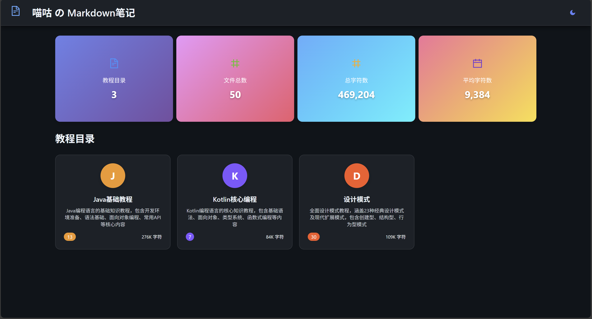
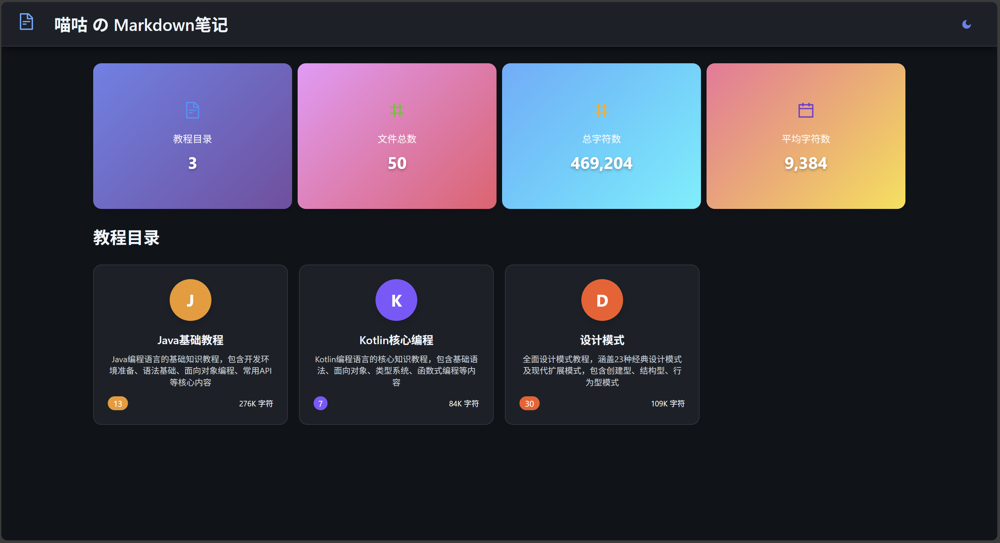
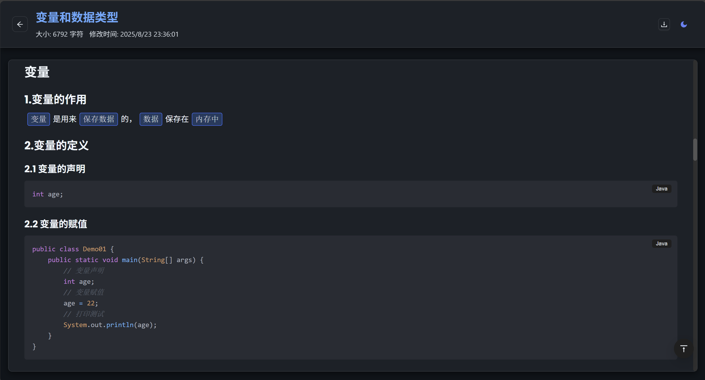
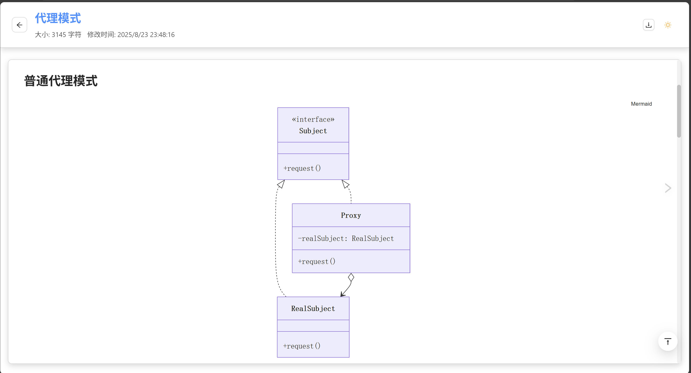
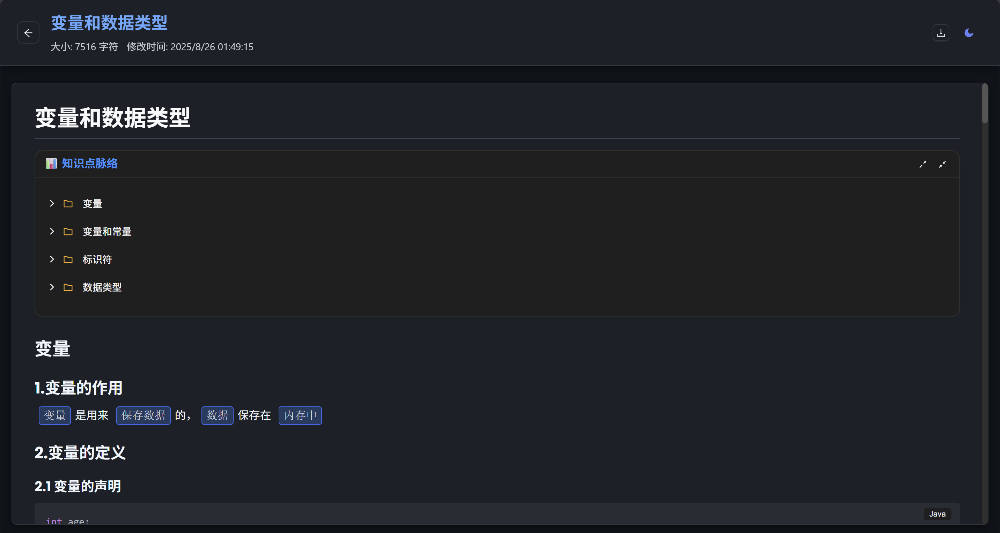
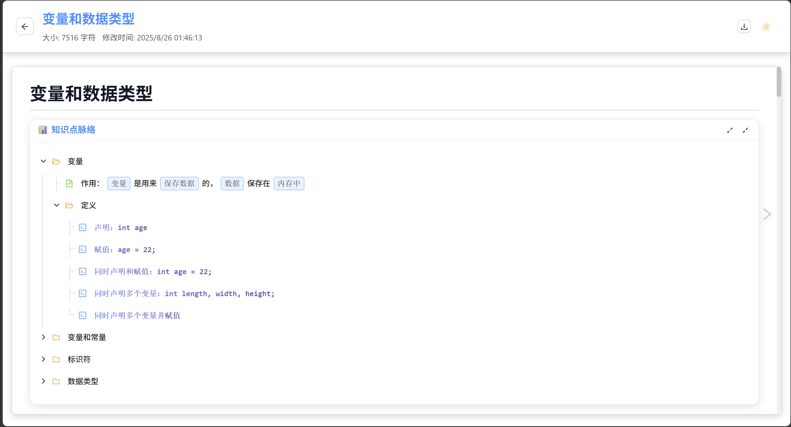
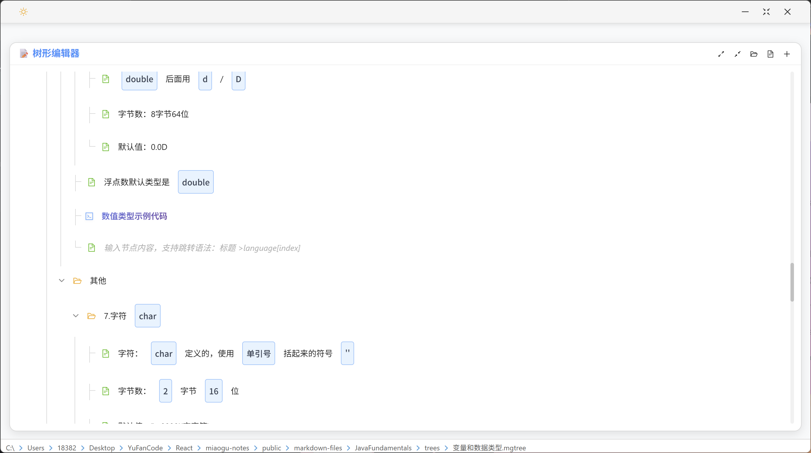

# 喵咕学习笔记平台

     

**喵咕学习笔记平台**是一个专为学习者打造的现代化在线学习平台，基于React和Ant Design构建。平台提供智能笔记管理、沉浸式阅读体验、学习进度统计等功能，让知识学习变得更加高效和愉悦(/≧▽≦)/。

## 🚀 在线体验

**🍀** **立即体验**：[喵咕md笔记](https://md.miaogu.top)

## ✨ 核心特性

### 📚 智能笔记管理

- **笔记统计分析**：自动统计学习笔记数量、字数、学习时长等关键指标
- **知识体系展示**：树形结构展示知识点组织架构
- **MGTree格式支持**：专业的树状知识点格式，支持代码跳转和层级管理
- **书签定位**：快速定位到上次浏览的笔记和知识点，关闭网站后不会丢失

### 📖 沉浸式学习体验

- **Markdown渲染**：支持GFM标准语法，完美渲染各种学习内容
- **Tree知识图谱**：现代化树状图组件，支持展开折叠和代码跳转
- **代码高亮**：集成Prism.js，支持多种编程语言语法高亮
- **Mermaid图表**：原生支持流程图、思维导图等各种学习图表
- **智能翻页**：键盘快捷键、鼠标悬停箭头、移动端手势支持

### 🎨 个性化学习界面

- **响应式布局**：完美适配桌面端和移动端学习场景
- **护眼主题**：支持明暗主题无缝切换，保护视力健康
- **简约设计**：专注学习内容的现代化界面设计

## 🌳 Tree格式支持

### Tree代码的三种引入方式

#### 1. 直接引用（推荐）

直接在Markdown中使用 `@tree()`语法，无需代码块包装：

```markdown
@tree(变量和数据类型)
```

支持相对路径：

```markdown
@tree(./trees/变量和数据类型)
```

#### 2. 根据h1标题自动引入

当Markdown文件中存在h1标题时，系统会自动查找同名的 `.mgtree`文件：

```markdown
# 变量和数据类型
```

系统会自动查找并引入 `trees/变量和数据类型.mgtree` 文件。

#### 3. Tree代码块硬编码

直接在tree代码块中编写树状内容：

````tree
```tree
变量
	作用：`变量`是用来`保存数据`的
	定义
		声明：int age;
		赋值：age = 22;
数据类型
	基本类型：简单类型
	引用类型：复杂类型
```
````

### MGTree文件格式

`.mgtree` 文件使用缩进来表示层级关系，支持丰富的跳转语法：

#### 基本语法

```
根节点
	一级子节点
		二级子节点
			三级子节点
	另一个一级子节点
		包含 `代码`的节点
```

#### 跳转节点语法

##### 1. 基本跳转 `>language[n]`
跳转到页面中第n个指定语言的代码块：

运算结果取高位（类型） >java[1]
除法运算的除数不能为0 >java[1]

##### 2. 简化跳转 `>language`

同上一个跳转节点指定的代码块：

```tree
基本语法示例 >java
```

##### 3. 连续跳转 `>language++`

跳转到下一个连续的代码块（自动递增索引）：

```tree
声明：int age >java[1]
赋值：age = 22; >java++
同时声明和赋值：int age = 22; >java++
```

##### 4. 偏移跳转 `>language+=n`

从当前位置偏移n个代码块：

```
枚举定义一组固定的常量 >java+=2
```

> #### 格式规则
>
> 1. **缩进**: 使用 Tab 或空格表示层级（建议使用 Tab）
> 2. **代码标记**: 使用反引号 \`code\` 标记代码内容
> 3. **跳转语法**: 支持多种跳转模式，灵活定位代码块
> 4. **特殊字符**: 支持中文、英文、数字、符号等
> 5. **空行**: 空行会被忽略
>

### MGTree编辑器

平台提供了专门的MGTree编辑器，具有以下特性：

#### 🎨 现代化界面
- **树状图风格**: 类似 XMind 的纵向逻辑图设计
- **主题支持**: 自动适配深色/浅色主题
- **响应式设计**: 完美适配不同屏幕尺寸

#### 🔧 编辑功能
- **展开/折叠**: 支持节点的展开和折叠操作
- **全部展开/折叠**: 一键操作所有节点
- **默认展开**: 默认展开前两级节点

#### 💻 智能识别
- **代码高亮**: 自动识别包含代码的节点并特殊标记
- **跳转预览**: 支持跳转语法的可视化预览
- **语法验证**: 实时验证mgtree语法正确性

#### ⚡ 性能优化
- **高性能渲染**: 优化的渲染性能，支持大型树结构
- **懒加载**: 按需加载节点内容
- **平滑动画**: 展开折叠的平滑过渡效果

## 📸 功能展示

### 学习统计概览

| 学习面板                          | 笔记列表                         |
| --------------------------------- | -------------------------------- |
|  |  |

### 深浅主题切换

| 深色模式                          | 浅色模式                            |
| --------------------------------- | ----------------------------------- |
|  |  |

### 沉浸式学习体验

| 笔记渲染                        | Mermaid图表                           |
| ------------------------------- | ------------------------------------- |
|  |  |

### 树状图

| 树状图                        | 跳转节点                           |
| ------------------------------- | ------------------------------------- |
|  |  |

### 树状图编辑器
| 深色模式                        | 浅色模式                           |
| ------------------------------- | ------------------------------------- |
|  |  |

## 🛠 技术架构

| 层级         | 技术组件                                     |
| ------------ | -------------------------------------------- |
| **前端框架** | React 18 + React Hooks                       |
| **桌面应用**     | Electron-vite + React + SASS               |
| **UI组件库** | Ant Design 5 + Ant Design Icons              |
| **状态管理** | Redux Toolkit + React Redux + Electron Store |
| **笔记渲染** | React Markdown + Remark GFM + Rehype         |
| **Tree格式** | MGTree解析器 + TreeViewer组件 + 跳转语法支持 |
| **代码高亮** | Prism.js + React Syntax Highlighter          |
| **图表支持** | Mermaid 11 (思维导图、流程图等)              |
| **学习体验** | 智能翻页、手势导航、主题切换                 |
| **构建工具** | Create React App + React Scripts             |

## 📂 项目结构

```
miaogoo-notes/
├── public/                    # 静态资源目录
│   ├── index.html            # HTML模板
│   ├── file-stats.json       # 学习统计数据
│   ├── file-summaries.json   # 笔记摘要数据
│   ├── folder-summaries.json # 知识分类数据
│   ├── images/               # 学习资源图片
│   └── markdown-files/       # 学习笔记库
│       ├── DesignPattern/    # 设计模式学习笔记
│       ├── JavaFundamentals/ # Java基础学习笔记
│       │   ├── trees/        # MGTree格式文件目录
│       │   │   ├── 变量和数据类型.mgtree
│       │   │   ├── 运算符.mgtree
│       │   │   ├── 流程控制语句.mgtree
│       │   │   └── 面向对象编程.mgtree
│       │   └── *.md          # Markdown笔记文件
│       └── KotlinEssentials/ # Kotlin基础学习笔记
│
├── editor/                   # Electron桌面应用（MGTree编辑器）
│   ├── electron-builder.yml
│   ├── electron.vite.config.mjs
│   ├── eslint.config.mjs
│   ├── package-lock.json
│   ├── package.json
│   ├── resources/
│   │   └── icon.svg
│   └── src/
│       ├── main/             # 主进程（文件管理、状态持久化）
│       ├── preload/          # 预加载脚本
│       └── renderer/         # 渲染进程（MGTree编辑界面）
│
├── src/                      # 源代码目录
│   ├── components/           # React组件
│   │   ├── Header.js         # 平台头部组件
│   │   ├── StatsGrid.js      # 学习统计组件
│   │   ├── FoldersList.js    # 知识分类组件
│   │   ├── FilesList.js      # 笔记列表组件
│   │   ├── MarkdownViewer.js # 笔记阅读器
│   │   ├── TreeViewer.js     # MGTree格式渲染器
│   │   └── MermaidRenderer.js # 学习图表渲染器
│   │
│   ├── store/                # Redux状态管理
│   │   ├── index.js          # Store配置
│   │   ├── appSlice.js       # 应用状态切片
│   │   └── hooks.js          # Redux Hooks
│   │
│   ├── theme/                # 主题系统
│   │   ├── ThemeContext.js   # 主题上下文
│   │   ├── colors.js         # 护眼配色方案
│   │   └── utils.js          # 主题工具函数
│   │
│   ├── utils/                # 工具函数
│   │   ├── fileUtils.js      # 笔记处理工具
│   │   └── formatUtils.js    # 内容格式化工具
│   │
│   ├── plugins/              # 插件系统
│   │   └── toast.js          # 学习提示插件
│   │
│   ├── App.js                # 主应用组件
│   └── index.js              # 应用入口
│
├── package.json              # 项目配置
└── README.md                 # 项目文档
```

## 🚀 开发环境

### 前置要求

- **Node.js** >= 16.0.0
- **npm** >= 8.0.0 或 **yarn** >= 1.22.0
- 现代浏览器（Chrome、Firefox、Safari、Edge）

### 启动开发环境

1. **克隆项目**
   ```bash
   git clone <repository-url>
   cd miaogoo-notes

2. **安装依赖**

   ```bash
   npm install
   # 或使用 yarn
   yarn install
   ```
3. **启动开发服务器**

   ```bash
   npm start
   # 或使用 yarn
   yarn start
   ```

   应用将在 `http://localhost:3000` 启动
4. **构建生产版本**

   ```bash
   npm run build
   # 或使用 yarn
   yarn build
   ```

   构建文件将输出到 `build/` 目录

7. **启动MGTree编辑器（可选）

   ```bash
   cd editor
   npm install
   npm run dev
   ```

   桌面编辑器将启动，支持MGTree文件的可视化编辑

8. **直接构建桌面端**

   ```bash
   npm run build
   # 或使用 yarn
   yarn build
   ```

   构建文件将输出到 `disk/` 目录

## 🤝 贡献指南

我们欢迎所有形式的贡献！请遵循以下步骤：

1. **Fork 本仓库**
2. **创建特性分支**
   ```bash
   git checkout -b feature/amazing-feature
   ```
3. **提交更改**
   ```bash
   git commit -m 'feat: add amazing feature'
   ```
4. **推送到分支**
   ```bash
   git push origin feature/amazing-feature
   ```
5. **创建 Pull Request**

### 代码规范

- 遵循 ESLint 配置
- 使用 Prettier 格式化代码
- 编写有意义的提交信息
- 为新功能添加测试

### 问题反馈

如果您发现 bug 或有学习功能建议，请创建 [Issue](../../issues)。

## 📄 许可证

本项目采用 MIT 许可证 - 查看 [LICENSE](LICENSE) 文件了解详情。

---

<div align="center">
  <p>如果喵咕学习笔记平台对您的学习有帮助(｡･ω･)ﾉﾞ♪，请给它一个 ⭐️</p>
  <p>Made with ❤️ for learners everywhere</p>
  <p><strong>让学习变得更简单，让知识触手可及 ✨</strong></p>
</div>
