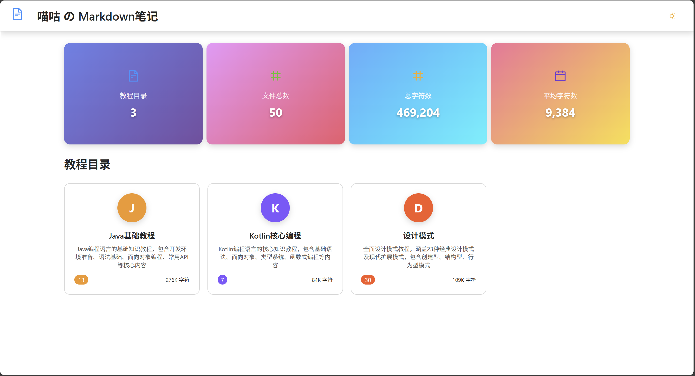

# 喵咕学习笔记平台

   

**喵咕学习笔记平台**是一个专为学习者打造的现代化在线学习平台，基于React和Ant Design构建。平台提供智能笔记管理、沉浸式阅读体验、学习进度统计等功能，让知识学习变得更加高效和愉悦(/≧▽≦)/。

## 🚀 在线体验

**🍀** **立即体验**：[喵咕md笔记](https://md.miaogu.top)

## ✨ 核心特性

### 📚 智能笔记管理

- **笔记统计分析**：自动统计学习笔记数量、字数、学习时长等关键指标
- **知识体系展示**：树形结构展示知识点组织架构
- **书签定位**：快速定位到上次浏览的笔记和知识点，关闭网站后不会丢失

### 📖 沉浸式学习体验

- **Markdown渲染**：支持GFM标准语法，完美渲染各种学习内容
- **代码高亮**：集成Prism.js，支持多种编程语言语法高亮
- **Mermaid图表**：原生支持流程图、思维导图等各种学习图表
- **智能翻页**：键盘快捷键、鼠标悬停箭头、移动端手势支持

### 🎨 个性化学习界面

- **响应式布局**：完美适配桌面端和移动端学习场景
- **护眼主题**：支持明暗主题无缝切换，保护视力健康
- **简约设计**：专注学习内容的现代化界面设计

## 📸 功能展示

### 学习统计概览

| 学习面板                        | 笔记列表                      |
| ------------------------------- | ----------------------------- |
|  |  |

### 深浅主题切换

| 深色模式                           | 浅色模式                         |
| ------------------------------------ | ---------------------------------- |
|  |  |

### 沉浸式学习体验

| 笔记渲染                          | Mermaid图表                           |
| --------------------------------- | ---------------------------------- |
|  |  |


## 🛠 技术架构

| 层级                   | 技术组件                                    |
| ---------------------- | ------------------------------------------- |
| **前端框架**     | React 18 + React Hooks                      |
| **UI组件库**     | Ant Design 5 + Ant Design Icons             |
| **状态管理**     | Redux Toolkit + React Redux + Redux Persist |
| **笔记渲染**     | React Markdown + Remark GFM + Rehype        |
| **代码高亮**     | Prism.js + React Syntax Highlighter         |
| **图表支持**     | Mermaid 11 (思维导图、流程图等)                |
| **学习体验**     | 智能翻页、手势导航、主题切换                   |
| **构建工具**     | Create React App + React Scripts            |

## 📂 项目结构

```
miaogoo-notes/
├── public/                    # 静态资源目录
│   ├── index.html            # HTML模板
│   ├── file-stats.json       # 学习统计数据
│   ├── file-summaries.json   # 笔记摘要数据
│   ├── folder-summaries.json # 知识分类数据
│   ├── images/               # 学习资源图片
│   └── markdown-files/       # 学习笔记库
│       ├── DesignPattern/    # 设计模式学习笔记
│       ├── JavaFundamentals/ # Java基础学习笔记
│       └── KotlinEssentials/ # Kotlin基础学习笔记
│
├── src/                      # 源代码目录
│   ├── components/           # React组件
│   │   ├── Header.js         # 平台头部组件
│   │   ├── StatsGrid.js      # 学习统计组件
│   │   ├── FoldersList.js    # 知识分类组件
│   │   ├── FilesList.js      # 笔记列表组件
│   │   ├── MarkdownViewer.js # 笔记阅读器
│   │   └── MermaidRenderer.js # 学习图表渲染器
│   │
│   ├── store/                # Redux状态管理
│   │   ├── index.js          # Store配置
│   │   ├── appSlice.js       # 应用状态切片
│   │   └── hooks.js          # Redux Hooks
│   │
│   ├── theme/                # 主题系统
│   │   ├── ThemeContext.js   # 主题上下文
│   │   ├── colors.js         # 护眼配色方案
│   │   └── utils.js          # 主题工具函数
│   │
│   ├── utils/                # 工具函数
│   │   ├── fileUtils.js      # 笔记处理工具
│   │   └── formatUtils.js    # 内容格式化工具
│   │
│   ├── plugins/              # 插件系统
│   │   └── toast.js          # 学习提示插件
│   │
│   ├── App.js                # 主应用组件
│   └── index.js              # 应用入口
│
├── package.json              # 项目配置
└── README.md                 # 项目文档
```

## 🚀 开发环境

### 前置要求

- **Node.js** >= 16.0.0
- **npm** >= 8.0.0 或 **yarn** >= 1.22.0
- 现代浏览器（Chrome、Firefox、Safari、Edge）

### 启动开发环境

1. **克隆项目**
   ```bash
   git clone <repository-url>
   cd miaogoo-notes
   ```
2. **安装依赖**

   ```bash
   npm install
   # 或使用 yarn
   yarn install
   ```
3. **启动开发服务器**

   ```bash
   npm start
   # 或使用 yarn
   yarn start
   ```

   应用将在 `http://localhost:3000` 启动
4. **构建生产版本**

   ```bash
   npm run build
   # 或使用 yarn
   yarn build
   ```

   构建文件将输出到 `build/` 目录
5. **运行测试**

   ```bash
   npm test
   # 或使用 yarn
   yarn test
   ```

## 🤝 贡献指南

我们欢迎所有形式的贡献！请遵循以下步骤：

1. **Fork 本仓库**
2. **创建特性分支**
   ```bash
   git checkout -b feature/amazing-feature
   ```
3. **提交更改**
   ```bash
   git commit -m 'feat: add amazing feature'
   ```
4. **推送到分支**
   ```bash
   git push origin feature/amazing-feature
   ```
5. **创建 Pull Request**

### 代码规范

- 遵循 ESLint 配置
- 使用 Prettier 格式化代码
- 编写有意义的提交信息
- 为新功能添加测试

### 问题反馈

如果您发现 bug 或有学习功能建议，请创建 [Issue](../../issues)。

## 📄 许可证

本项目采用 MIT 许可证 - 查看 [LICENSE](LICENSE) 文件了解详情。

---

<div align="center">
  <p>如果喵咕学习笔记平台对您的学习有帮助(｡･ω･)ﾉﾞ♪，请给它一个 ⭐️</p>
  <p>Made with ❤️ for learners everywhere</p>
  <p><strong>让学习变得更简单，让知识触手可及 ✨</strong></p>
</div>
