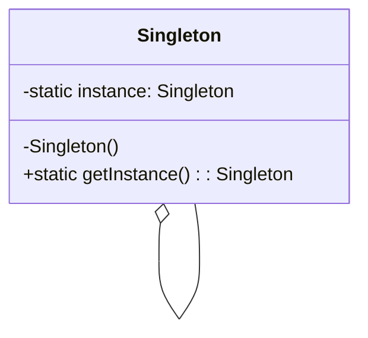

# 单例模式

解释：确保`一个类`只有`一个实例`，并提供一个`全局访问点`。

## 角色介绍
- **Singleton（单例）**: 拥有一个私有构造函数、一个静态私有成员变量和一个静态公有的获取实例方法的类。



### Kotlin天生单例

`Kotlin`具有天生单例`object`。

```kotlin
// 使用 object 关键字直接声明单例
object Singleton {
    // 无需显式定义构造函数和伴生对象
}

fun main() {
    val instance1 = Singleton
    val instance2 = Singleton

    println("Object Singleton Test: ${instance1 === instance2}") // 输出 true
}
```


### 饿汉式模式（Eager Initialization）

在`类加载`时就创建`单例实例`，确保在`多线程环境`中是`线程安全`的。由于实例在`类加载`时就`创建`，所以没有`延迟初始化`的开销。

```kotlin
class EagerSingleton private constructor() {
    companion object {
        val instance: EagerSingleton = EagerSingleton()
    }
}

fun main() {
    val instance1 = EagerSingleton.instance
    val instance2 = EagerSingleton.instance

    println("EagerSingleton Test: ${instance1 === instance2}") // 输出 true
}
```

### 懒汉式模式（Lazy Initialization）

在第一次调用 `getInstance()` 方法时`创建实例`。适合`需要延迟加载`的场景，但在`多线程环境`下需要`处理线程安全`问题。

```kotlin
class LazySingleton private constructor() {
    companion object {
        private var instance: LazySingleton? = null
        
        fun getInstance(): LazySingleton {
            if (instance == null) {
                instance = LazySingleton()
            }
            return instance!!
        }
    }
}

fun main() {
    val instance1 = LazySingleton.getInstance()
    val instance2 = LazySingleton.getInstance()

    println("LazySingleton Test: ${instance1 === instance2}") // 输出 true
}
```

### 线程安全的懒汉式（Synchronized）

在 `getInstance()` 方法上加上 `synchronized` 关键字，以确保线程安全。每次调用 `getInstance()` 时都需要进行同步。

```kotlin
class SynchronizedLazySingleton private constructor() {
    companion object {
        private var instance: SynchronizedLazySingleton? = null
        
        @Synchronized
        fun getInstance(): SynchronizedLazySingleton {
            if (instance == null) {
                instance = SynchronizedLazySingleton()
            }
            return instance!!
        }
    }
}

fun main() {
    val instance1 = SynchronizedLazySingleton.getInstance()
    val instance2 = SynchronizedLazySingleton.getInstance()

    println("SynchronizedLazySingleton Test: ${instance1 === instance2}") // 输出 true
}
```

### 双重检查锁定（Double-Checked Locking）

在 `getInstance()` 方法中使用双重检查锁定来保证线程安全，同时避免每次调用时都加锁，从而提高性能。

```kotlin
class DoubleCheckedLockingSingleton private constructor() {
    companion object {
        @Volatile
        private var instance: DoubleCheckedLockingSingleton? = null
        
        fun getInstance(): DoubleCheckedLockingSingleton {
            if (instance == null) {
                synchronized(DoubleCheckedLockingSingleton::class.java) {
                    if (instance == null) {
                        instance = DoubleCheckedLockingSingleton()
                    }
                }
            }
            return instance!!
        }
    }
}

fun main() {
    val instance1 = DoubleCheckedLockingSingleton.getInstance()
    val instance2 = DoubleCheckedLockingSingleton.getInstance()

    println("DoubleCheckedLockingSingleton Test: ${instance1 === instance2}") // 输出 true
}
```

### 静态内部类（Initialization-on-demand Holder Idiom）

利用 Java 的`类加载`机制，在`需要时`才`加载静态内部类`，从而实现`懒加载`和`线程安全`。

```kotlin
class StaticInnerClassSingleton private constructor() {
    companion object {
        fun getInstance(): StaticInnerClassSingleton = Holder.INSTANCE
    }
    
    private object Holder {
        val INSTANCE = StaticInnerClassSingleton()
    }
}

fun main() {
    val instance1 = StaticInnerClassSingleton.getInstance()
    val instance2 = StaticInnerClassSingleton.getInstance()

    println("StaticInnerClassSingleton Test: ${instance1 === instance2}") // 输出 true
}
```

### 枚举实现（Enumerate）

使用 `Kotlin 枚举类型`来实现单例模式，`简单`且`自动`支持`序列化`，防止`反序列化`时产生`新的实例`。

```kotlin
enum class EnumSingleton {
    INSTANCE
}

fun main() {
    val instance1 = EnumSingleton.INSTANCE
    val instance2 = EnumSingleton.INSTANCE

    println("EnumSingleton Test: ${instance1 === instance2}") // 输出 true
}
```

