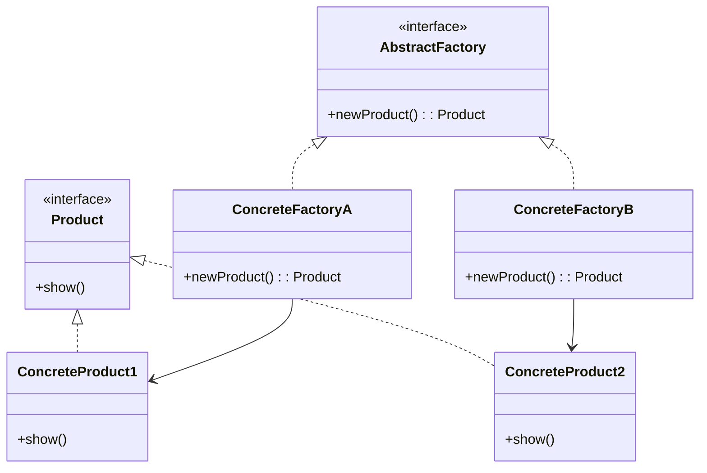

# 工厂模式

## 工厂方法模式

解释：为访问`Client类`提供一个`接口`，`接口`实现`具体产品`类。

`具体工厂` 依赖 `具体产品`，创建`具体产品`的`实例`。

`具体工厂`类是`抽象工厂`的`泛化`或`实现`。

## 角色介绍
- **Product（抽象产品）**: 定义工厂方法所创建的对象的接口。
- **ConcreteProduct（具体产品）**: 实现Product接口的具体产品类。
- **AbstractFactory（抽象工厂）**: 声明工厂方法，返回一个Product类型的对象。
- **ConcreteFactory（具体工厂）**: 重定义工厂方法以返回一个ConcreteProduct实例。



```kotlin
package com.pattern.factory

// Product接口，提供给Client
interface Product {
    fun show()
}

// 具体产品1和2，实现Product类
class ConcreteProduct1 : Product {
    override fun show() {
        println("ConcreteProduct1 showed...")
    }
}

class ConcreteProduct2 : Product {
    override fun show() {
        println("ConcreteProduct1 showed...")
    }
}

// 抽象工厂类
interface AbstractFactory {
    fun newProduct(): Product
}

// 具体工厂类
class ConcreteFactoryA : AbstractFactory {
    override fun newProduct(): Product {
        return ConcreteProduct1()
    }
}

class ConcreteFactoryB : AbstractFactory {
    override fun newProduct(): Product {
        return ConcreteProduct2()
    }
}

fun main() {
    // 1.实例化工厂
    val factoryA: AbstractFactory = ConcreteFactoryA()
    // 2.使用工厂实例化产品
    val productA: Product = factoryA.newProduct()
    // 3.产品方法调用
    productA.show()

    val factoryB: AbstractFactory = ConcreteFactoryB()
    val productB: Product = factoryB.newProduct()
    productB.show()
}
```

