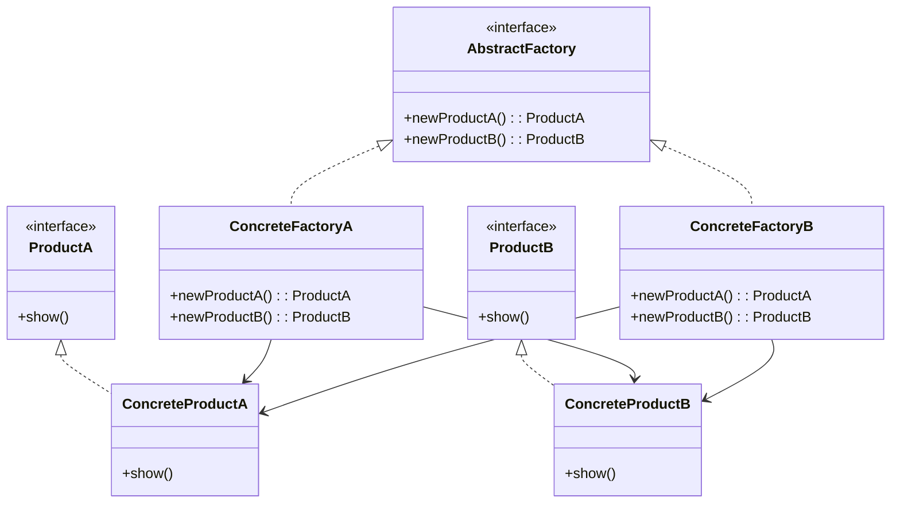

# 抽象工厂模式

解释：提供一个创建`一系列相关`或`相互依赖对象`的接口，而`无需指定`它们的`具体类`。

## 角色介绍
- **AbstractFactory（抽象工厂）**: 声明一组用于创建一系列产品的方法。
- **ConcreteFactory（具体工厂）**: 实现抽象工厂声明的创建产品的方法。
- **AbstractProduct（抽象产品）**: 为一类产品声明接口。
- **ConcreteProduct（具体产品）**: 定义由相应的具体工厂创建的产品对象，实现抽象产品接口。
- **Client（客户端）**: 仅使用由抽象工厂和抽象产品类声明的接口。



```kotlin
package com.pattern.abstractFactory

// Product接口，提供给Client
interface ProductA {
    fun show()
}

// Product接口，提供给Client
interface ProductB {
    fun show()
}

// 具体产品A和B，实现Product类
class ConcreteProductA : ProductA {
    override fun show() {
        println("ConcreteProductA showed...")
    }
}

class ConcreteProductB : ProductB {
    override fun show() {
        println("ConcreteProductB showed...")
    }
}

// 抽象工厂类
interface AbstractFactory {
    fun newProductA(): ProductA
    fun newProductB(): ProductB
}

// 具体工厂类A
class ConcreteFactoryA : AbstractFactory {
    override fun newProductA(): ProductA {
        return ConcreteProductA()
    }

    override fun newProductB(): ProductB {
        return ConcreteProductB()
    }
}

// 具体工厂类B
class ConcreteFactoryB : AbstractFactory {
    override fun newProductA(): ProductA {
        return ConcreteProductA() // Assuming a different implementation for factory B if needed
    }

    override fun newProductB(): ProductB {
        return ConcreteProductB() // Assuming a different implementation for factory B if needed
    }
}

fun main() {
    // 1. 实例化工厂A
    val factoryA: AbstractFactory = ConcreteFactoryA()
    // 2. 使用工厂实例化产品A
    val productA: ProductA = factoryA.newProductA()
    // 3. 产品方法调用
    productA.show()

    // 1. 实例化工厂B
    val factoryB: AbstractFactory = ConcreteFactoryB()
    // 2. 使用工厂实例化产品B
    val productB: ProductB = factoryB.newProductB()
    // 3. 产品方法调用
    productB.show()
}
```