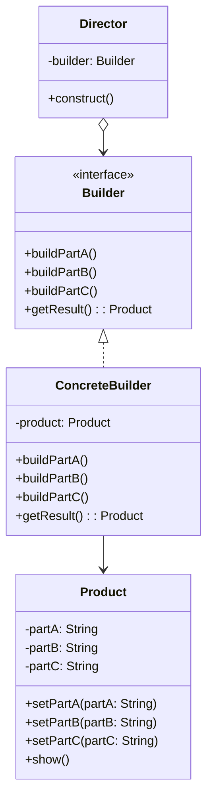

# 建造者模式

解释：将一个复杂对象的`构建过程`与其`表示`分离，使得同样的构建过程可以创建不同的表示。

## 角色介绍
- **Builder（抽象建造者）**: 为创建一个产品对象的各个部件指定抽象接口。
- **ConcreteBuilder（具体建造者）**: 实现Builder接口，构建和装配各个部件。
- **Director（指挥者）**: 构建一个使用Builder接口的对象。
- **Product（产品）**: 表示被构造的复杂对象。



```kotlin
// 产品类
class Product {
    private var partA: String = ""
    private var partB: String = ""
    private var partC: String = ""
    
    fun setPartA(partA: String) {
        this.partA = partA
    }
    
    fun setPartB(partB: String) {
        this.partB = partB
    }
    
    fun setPartC(partC: String) {
        this.partC = partC
    }
    
    fun show() {
        println("Product Parts: $partA, $partB, $partC")
    }
}

// 抽象建造者
interface Builder {
    fun buildPartA()
    fun buildPartB()
    fun buildPartC()
    fun getResult(): Product
}

// 具体建造者
class ConcreteBuilder : Builder {
    private val product = Product()
    
    override fun buildPartA() {
        product.setPartA("Part A")
        println("Building Part A")
    }
    
    override fun buildPartB() {
        product.setPartB("Part B")
        println("Building Part B")
    }
    
    override fun buildPartC() {
        product.setPartC("Part C")
        println("Building Part C")
    }
    
    override fun getResult(): Product {
        return product
    }
}

// 指挥者
class Director(private val builder: Builder) {
    fun construct() {
        builder.buildPartA()
        builder.buildPartB()
        builder.buildPartC()
    }
}

fun main() {
    val builder: Builder = ConcreteBuilder()
    val director = Director(builder)
    director.construct()
    val product = builder.getResult()
    product.show()
}
```

### Kotlin中的建造者模式

Kotlin提供了更简洁的方式来实现建造者模式，可以使用命名参数、默认参数和DSL风格的构建器。

```kotlin
// 使用数据类和命名参数
data class Person(
    val name: String,
    val age: Int = 0,
    val address: String = "",
    val email: String = "",
    val phone: String = ""
)

fun main() {
    // 使用命名参数创建对象
    val person = Person(
        name = "张三",
        age = 30,
        address = "北京市",
        email = "zhangsan@example.com"
    )
    println(person)
}
```

```kotlin
// 使用DSL风格的构建器
class PersonBuilder {
    var name: String = ""
    var age: Int = 0
    var address: String = ""
    var email: String = ""
    var phone: String = ""
    
    fun build(): Person = Person(name, age, address, email, phone)
}

// 扩展函数用于创建DSL
fun person(block: PersonBuilder.() -> Unit): Person {
    val builder = PersonBuilder()
    builder.block()
    return builder.build()
}

fun main() {
    // 使用DSL风格创建对象
    val person = person {
        name = "李四"
        age = 25
        address = "上海市"
        email = "lisi@example.com"
    }
    println(person)
}
```