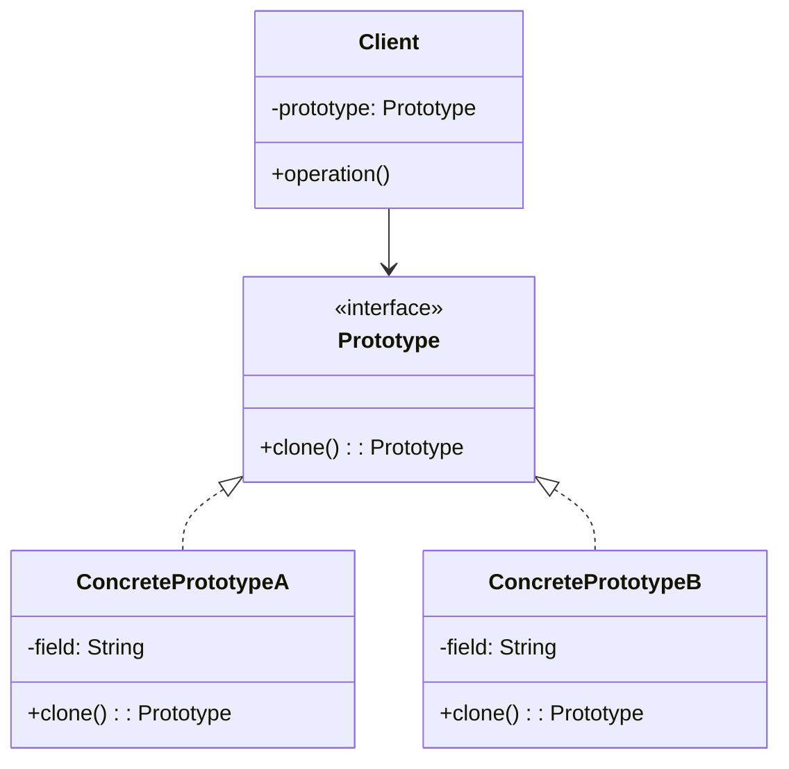

# 原型模式

解释：通过`复制`现有对象来创建新对象，而不是通过实例化类来创建。

## 角色介绍
- **Prototype（原型接口）**: 声明克隆自身的接口。
- **ConcretePrototype（具体原型）**: 实现克隆自身的操作。
- **Client（客户端）**: 通过原型接口请求克隆对象。



```kotlin
// 原型接口
interface Prototype {
    fun clone(): Prototype
}

// 具体原型A
class ConcretePrototypeA(private var field: String) : Prototype {
    override fun clone(): Prototype {
        return ConcretePrototypeA(field)
    }
    
    fun getField(): String = field
    
    fun setField(field: String) {
        this.field = field
    }
    
    override fun toString(): String {
        return "ConcretePrototypeA [field=$field]"
    }
}

// 具体原型B
class ConcretePrototypeB(private var field: String) : Prototype {
    override fun clone(): Prototype {
        return ConcretePrototypeB(field)
    }
    
    fun getField(): String = field
    
    fun setField(field: String) {
        this.field = field
    }
    
    override fun toString(): String {
        return "ConcretePrototypeB [field=$field]"
    }
}

fun main() {
    // 创建原型对象
    val prototypeA = ConcretePrototypeA("A")
    val prototypeB = ConcretePrototypeB("B")
    
    // 克隆原型对象
    val cloneA = prototypeA.clone() as ConcretePrototypeA
    val cloneB = prototypeB.clone() as ConcretePrototypeB
    
    // 修改克隆对象的属性
    cloneA.setField("A-Clone")
    cloneB.setField("B-Clone")
    
    // 输出原型对象和克隆对象
    println("Original: $prototypeA")
    println("Clone: $cloneA")
    println("Original: $prototypeB")
    println("Clone: $cloneB")
}
```

### 深克隆与浅克隆

- **浅克隆**：只复制对象本身，不复制对象内部的引用类型的成员变量。
- **深克隆**：不仅复制对象本身，还复制对象内部的引用类型的成员变量。

```kotlin
// 深克隆示例
data class Address(var city: String, var street: String)

class Person(var name: String, var address: Address) : Cloneable {
    // 浅克隆
    fun shallowClone(): Person {
        return Person(name, address)
    }
    
    // 深克隆
    fun deepClone(): Person {
        return Person(name, Address(address.city, address.street))
    }
}

fun main() {
    val address = Address("北京", "朝阳区")
    val original = Person("张三", address)
    
    // 浅克隆
    val shallowClone = original.shallowClone()
    // 深克隆
    val deepClone = original.deepClone()
    
    // 修改原始对象的地址
    original.address.city = "上海"
    
    // 输出结果
    println("原始对象: ${original.name}, ${original.address.city}")
    println("浅克隆: ${shallowClone.name}, ${shallowClone.address.city}") // 上海（受原始对象影响）
    println("深克隆: ${deepClone.name}, ${deepClone.address.city}") // 北京（不受原始对象影响）
}
```