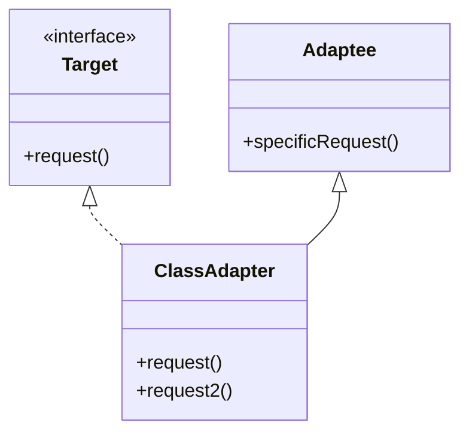
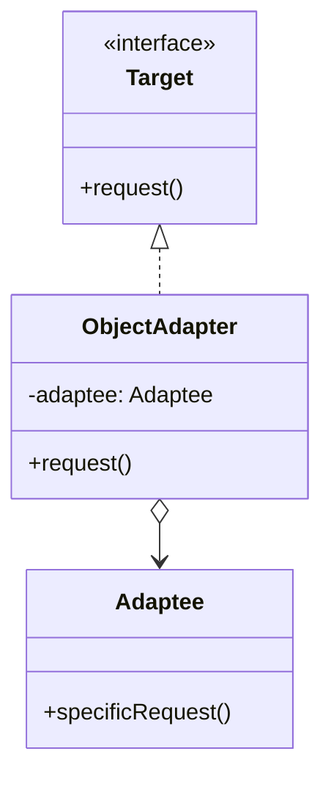

# 适配器模式

解释：将一个`类的接口`转换为用户期望使用的`目标接口`

## 角色介绍
- **Target（目标）**: 定义客户端使用的特定领域的接口。
- **Adaptee（适配者）**: 定义一个已经存在的接口，这个接口需要适配。
- **Adapter（适配器）**: 对Adaptee的接口与Target接口进行适配。

## 类适配器



```kotlin
interface Target {
    fun request()
}

open class Adaptee {
    fun specificRequest() {
        println("适配者中的业务代码被调用")
    }
}

class ClassAdapter : Adaptee(), Target {
    override fun request() {
        specificRequest()
    }
    
    fun request2() {
        specificRequest()
    }
}

fun main() {
    val target: Target = ClassAdapter()
    target.request()
}
```

### 对象适配器



```kotlin
interface Target {
    fun request()
}

class Adaptee {
    fun specificRequest() {
        println("适配者中的业务代码被调用")
    }
}

class ObjectAdapter(private val adaptee: Adaptee) : Target {
    override fun request() {
        adaptee.specificRequest()
    }
}

fun main() {
    val adaptee = Adaptee()
    val target: Target = ObjectAdapter(adaptee)
    target.request()
}
```

