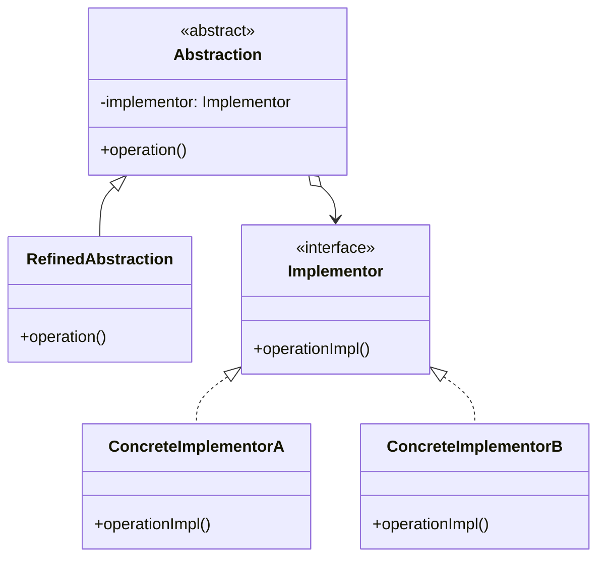

# 桥接模式

解释：将`抽象部分`与`实现部分`分离，使它们都可以独立地变化。通过组合的方式建立两个类之间的联系，而不是通过继承。

## 角色介绍
- **Abstraction（抽象类）**: 定义抽象类的接口，维护一个对实现部分的引用。
- **RefinedAbstraction（扩展抽象类）**: 扩展抽象类接口，实现更复杂的操作。
- **Implementor（实现类接口）**: 定义实现类的接口，该接口不一定要与抽象类的接口完全一致。
- **ConcreteImplementor（具体实现类）**: 实现实现类接口并定义具体实现。



### 桥接模式的优点
1. **分离抽象接口及其实现部分**：桥接模式使用「对象间的关联关系」解耦了抽象和实现之间固有的绑定关系，使得抽象和实现可以沿着各自的维度来变化。
2. **提高系统的可扩展性**：在两个变化维度中任意扩展一个维度，都不需要修改原有系统。
3. **实现细节对客户透明**：客户端不用关心实现是怎样完成的。

```kotlin
// 实现部分的接口
interface Implementor {
    fun operationImpl()
}

// 具体实现类A
class ConcreteImplementorA : Implementor {
    override fun operationImpl() {
        println("具体实现A的方法被调用")
    }
}

// 具体实现类B
class ConcreteImplementorB : Implementor {
    override fun operationImpl() {
        println("具体实现B的方法被调用")
    }
}

// 抽象部分
abstract class Abstraction(protected val implementor: Implementor) {
    abstract fun operation()
}

// 扩展抽象部分
class RefinedAbstraction(implementor: Implementor) : Abstraction(implementor) {
    override fun operation() {
        println("扩展抽象部分的操作")
        implementor.operationImpl()
    }
}

fun main() {
    // 创建具体实现A
    val implementorA: Implementor = ConcreteImplementorA()
    // 创建扩展抽象并关联具体实现A
    val abstractionA: Abstraction = RefinedAbstraction(implementorA)
    // 调用抽象部分的方法
    abstractionA.operation()
    
    // 创建具体实现B
    val implementorB: Implementor = ConcreteImplementorB()
    // 创建扩展抽象并关联具体实现B
    val abstractionB: Abstraction = RefinedAbstraction(implementorB)
    // 调用抽象部分的方法
    abstractionB.operation()
}
```