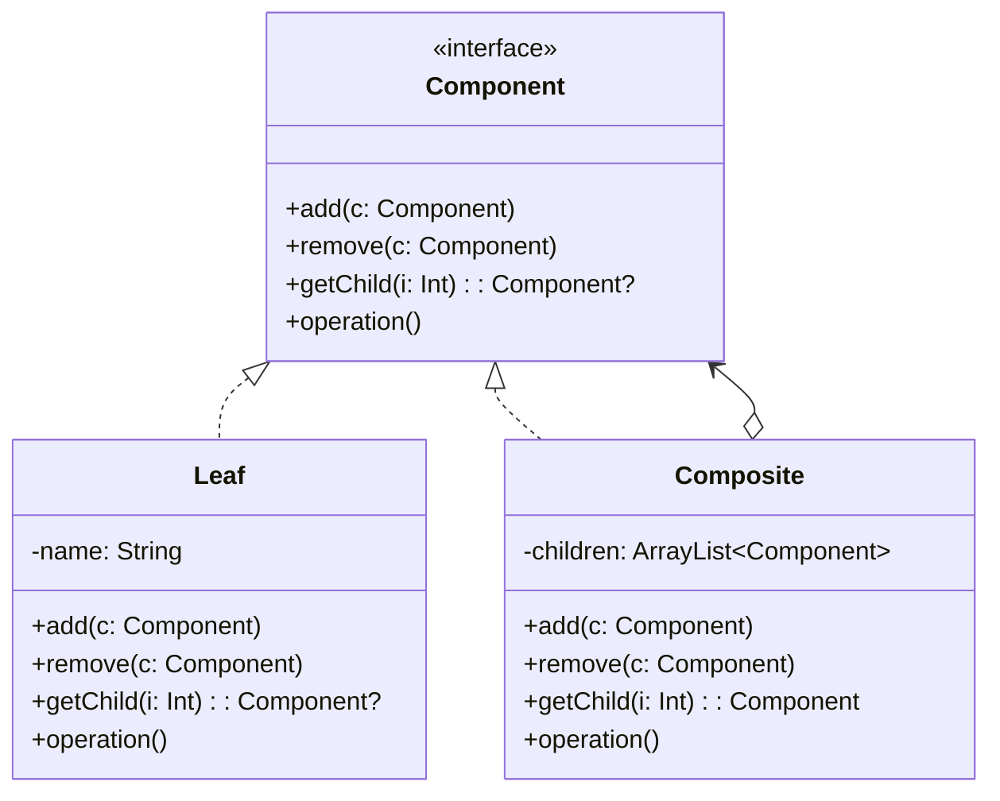
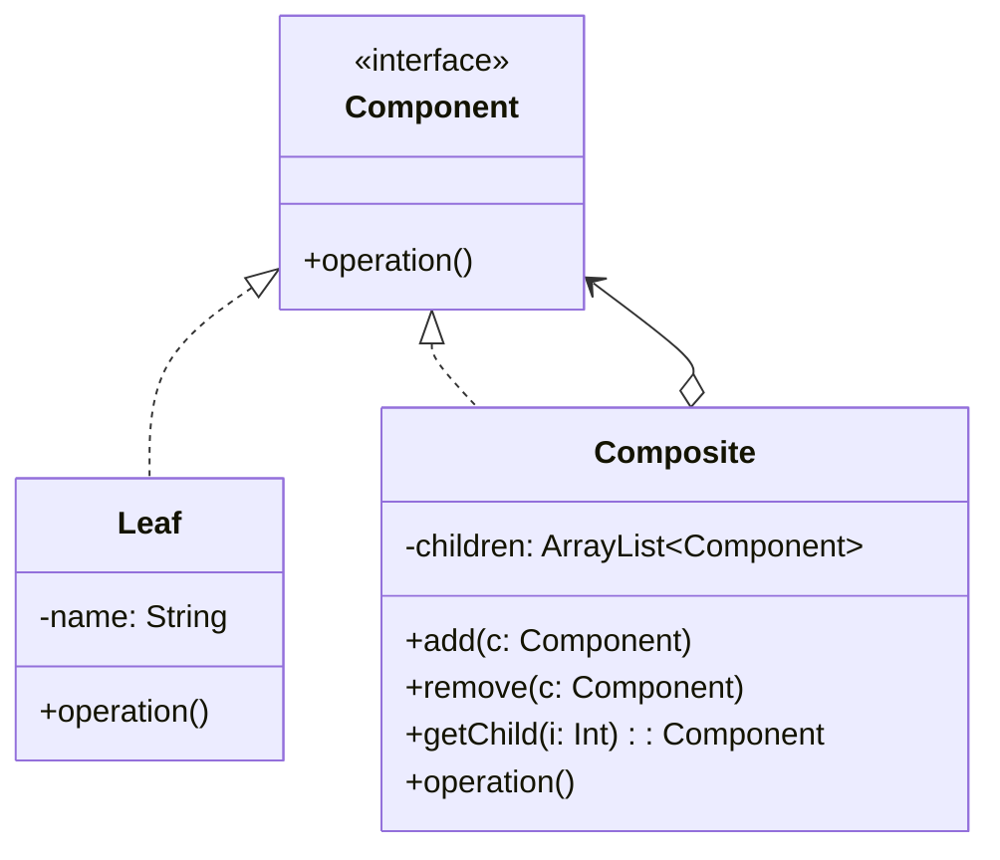

# 组合模式

解释：即`整体-部分`模式，将对象组合成树状的设计模式

## 角色介绍
- **Component（抽象构件）**: 定义参加组合对象的共有方法和属性。
- **Leaf（叶子构件）**: 组合中的叶节点对象，没有子节点。
- **Composite（容器构件）**: 组合中的分支节点对象，有子节点。

### 透明式组合模式

`客户角色`对`Component接口`依赖。`Leaf`和`Composite`中的所有方法都应提取到`Component接口`



```kotlin
interface Component {
    fun add(c: Component)
    fun remove(c: Component)
    fun getChild(i: Int): Component?
    fun operation()
}

class Leaf(private val name: String) : Component {
    override fun add(c: Component) {}
    override fun remove(c: Component) {}
    override fun getChild(i: Int): Component? {
        return null
    }
    
    override fun operation() {
        println("树叶$name被访问。")
    }
}

class Composite : Component {
    private val children = ArrayList<Component>()
    
    override fun add(c: Component) {
        children.add(c)
    }
    
    override fun remove(c: Component) {
        children.remove(c)
    }
    
    override fun getChild(i: Int): Component {
        return children[i]
    }
    
    override fun operation() {
        for (obj in children) {
            obj.operation()
        }
    }
}

fun main() {
    val c1 = Composite()
    val c2 = Composite()
    val leaf1 = Leaf("1")
    val leaf2 = Leaf("2")
    val leaf3 = Leaf("3")
    c1.add(leaf1)
    c1.add(c2)
    c2.add(leaf2)
    c2.add(leaf3)
    c1.operation()
}
```

### 安全式组合模式

安全式组合模式中，`Component接口`只声明公共方法，而容器特有的管理子构件的方法只在`Composite`类中声明。这样可以保证叶子构件没有管理子构件的方法，更加安全。



```kotlin
interface Component {
    fun operation()
}

class Leaf(private val name: String) : Component {
    override fun operation() {
        println("树叶$name被访问。")
    }
}

class Composite : Component {
    private val children = ArrayList<Component>()
    
    fun add(c: Component) {
        children.add(c)
    }
    
    fun remove(c: Component) {
        children.remove(c)
    }
    
    fun getChild(i: Int): Component {
        return children[i]
    }
    
    override fun operation() {
        for (obj in children) {
            obj.operation()
        }
    }
}

fun main() {
    val c1 = Composite()
    val c2 = Composite()
    val leaf1 = Leaf("1")
    val leaf2 = Leaf("2")
    val leaf3 = Leaf("3")
    c1.add(leaf1)
    c1.add(c2)
    c2.add(leaf2)
    c2.add(leaf3)
    c1.operation()
}
```

