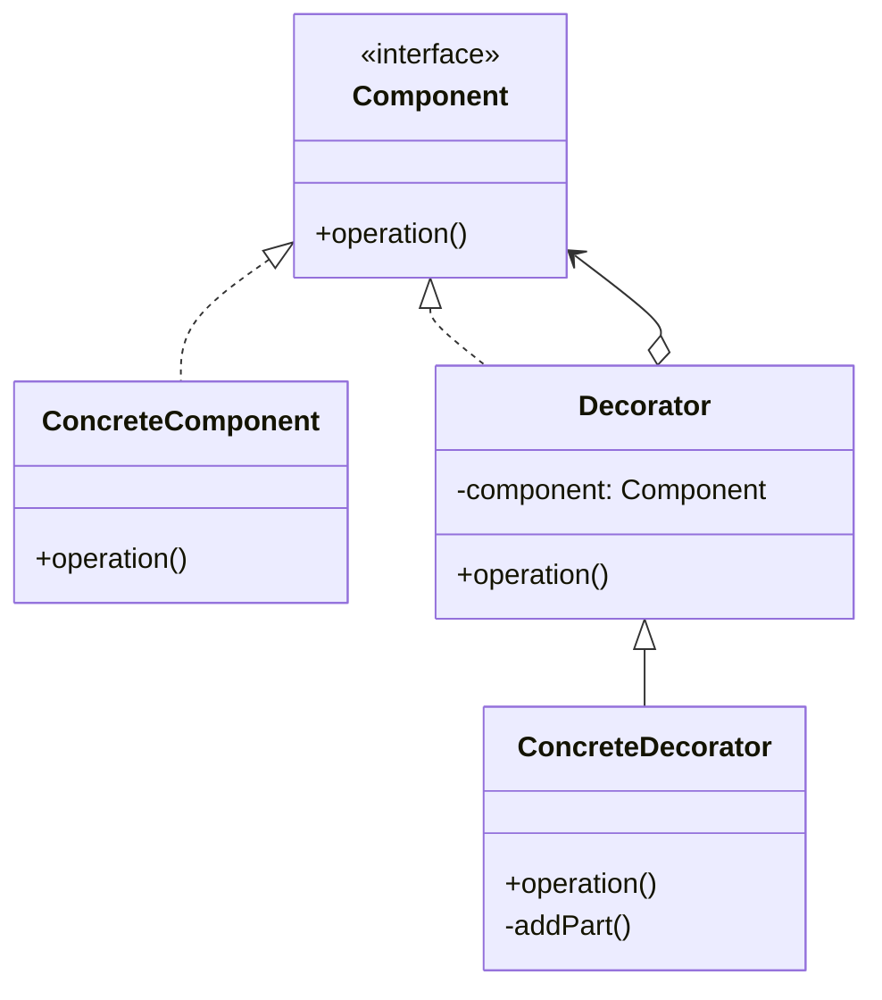

# 装饰模式

解释：`抽象装饰`方法`委托`给`抽象构件`。`具体装饰`委托给`父类` `抽象装饰`，以为`具体构件`提供额外功能

## 角色介绍
- **Component（抽象构件）**: 定义一个对象接口，可以给这些对象动态地添加职责。
- **ConcreteComponent（具体构件）**: 定义一个具体的对象，也可以给这个对象添加一些职责。
- **Decorator（抽象装饰类）**: 维持一个指向Component对象的引用，并定义一个与Component接口一致的接口。
- **ConcreteDecorator（具体装饰类）**: 具体的装饰对象，给构件对象添加附加的责任。



```kotlin
// 抽象构件
interface Component {
    fun operation()
}

// 具体构件
class ConcreteComponent : Component {
    override fun operation() {
        println("具体构件被调用")
    }
}

// 抽象装饰
open class Decorator(private val component: Component) : Component {
    override fun operation() {
        component.operation()
    }
}

// 具体装饰
class ConcreteDecorator(component: Component) : Decorator(component) {
    override fun operation() {
        super.operation()
        addPart()
    }

    private fun addPart() {
        println("具体构建增加的部分")
    }
}

fun main() {
    val component: Component = ConcreteComponent()
    val decorator: Decorator = ConcreteDecorator(component)
    decorator.operation()
}

```

