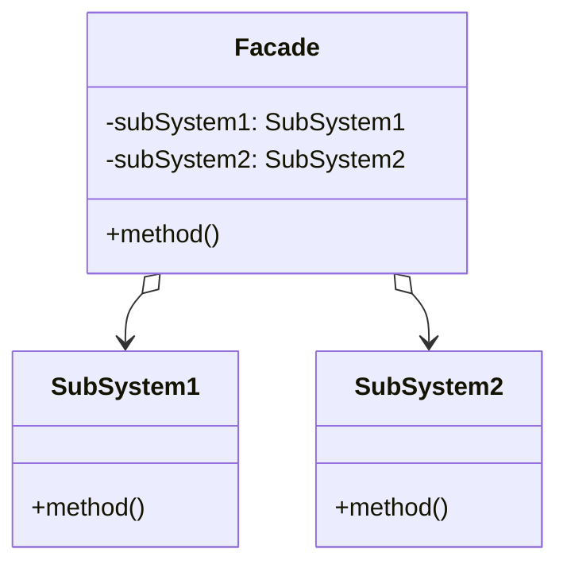

# 外观模式

解释：`对外`提供一个`统一接口`，使`子系统`更容易`被访问`

## 角色介绍
- **Facade（外观）**: 知道哪些子系统类负责处理请求，将客户的请求代理给适当的子系统对象。
- **SubSystem（子系统）**: 实现子系统的功能，处理Facade对象指派的任务。
- **Client（客户端）**: 通过调用Facade的方法来访问子系统的功能。



```kotlin
class Facade {
    private val obj1 = SubSystem1()
    private val obj2 = SubSystem2()
    
    fun method() {
        obj1.method()
        obj2.method()
    }
}

class SubSystem1 {
    fun method() {
        println("子系统1方法被调用")
    }
}

class SubSystem2 {
    fun method() {
        println("子系统2方法被调用")
    }
}

fun main() {
    val facade = Facade()
    facade.method()
}
```

