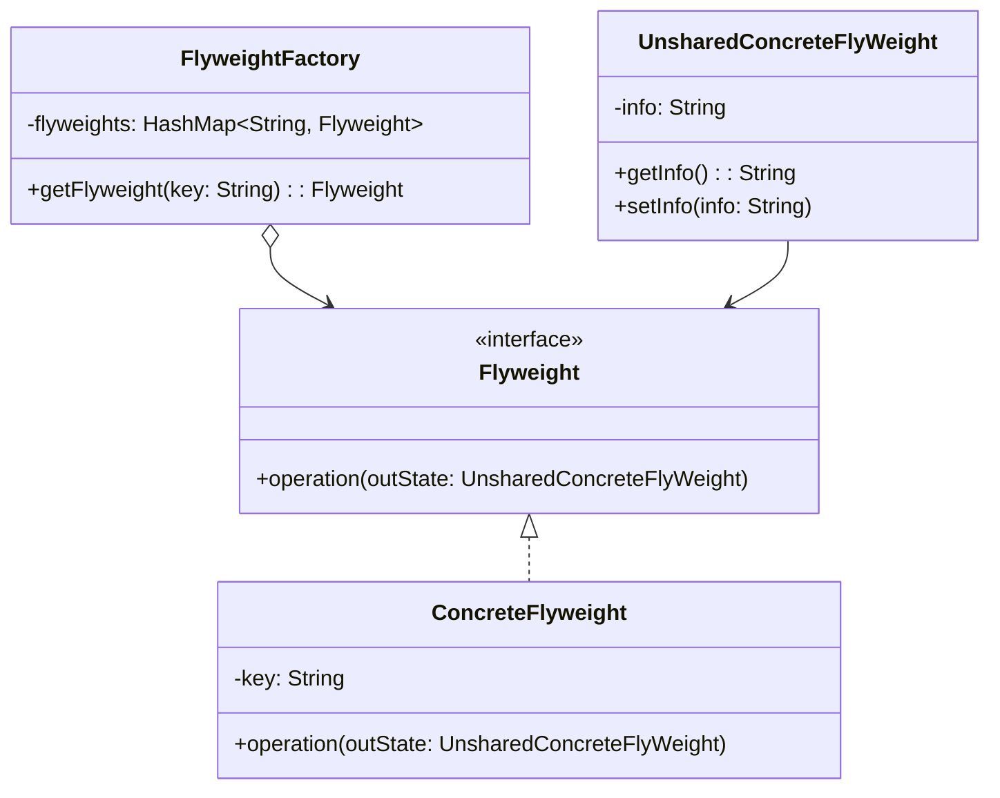

# 享元模式

解释：`减少`需要`创建的类`的`数量`，将`共性`定义到`享元角色`，`个性（外部状态信息）`定义到`非享元角色`，调用操作时`传递外部状态信息`

## 角色介绍
- **Flyweight（享元）**: 描述一个接口，通过这个接口flyweight可以接受并作用于外部状态。
- **ConcreteFlyweight（具体享元）**: 实现Flyweight接口，并为内部状态增加存储空间。
- **UnsharedConcreteFlyWeight（非共享具体享元）**: 不需要共享的Flyweight子类。
- **FlyweightFactory（享元工厂）**: 创建并管理flyweight对象，确保合理地共享flyweight。



```kotlin
import java.util.HashMap

// 非享元角色
class UnsharedConcreteFlyWeight(private var info: String) {
    fun getInfo(): String {
        return this.info
    }

    fun setInfo(info: String) {
        this.info = info
    }
}

// 抽象享元角色
interface Flyweight {
    fun operation(outState: UnsharedConcreteFlyWeight)
}

// 具体享元角色
class ConcreteFlyweight(private val key: String) : Flyweight {
    init {
        println("具体享元被创建！")
    }

    override fun operation(outState: UnsharedConcreteFlyWeight) {
        println("outState Info: ${outState.getInfo()}")
    }
}

class FlyweightFactory {
    private val flyweights = HashMap<String, Flyweight>()

    fun getFlyweight(key: String): Flyweight {
        var flyweight = flyweights[key]
        if (flyweight != null) {
            println("具体享元已存在，成功获取....！")
        } else {
            flyweight = ConcreteFlyweight(key)
            flyweights[key] = flyweight
        }
        return flyweight
    }
}

fun main() {
    val factory = FlyweightFactory()
    val f1 = factory.getFlyweight("a")
    val f2 = factory.getFlyweight("b")
    f1.operation(UnsharedConcreteFlyWeight("a info"))
    f2.operation(UnsharedConcreteFlyWeight("b info"))
}
```

