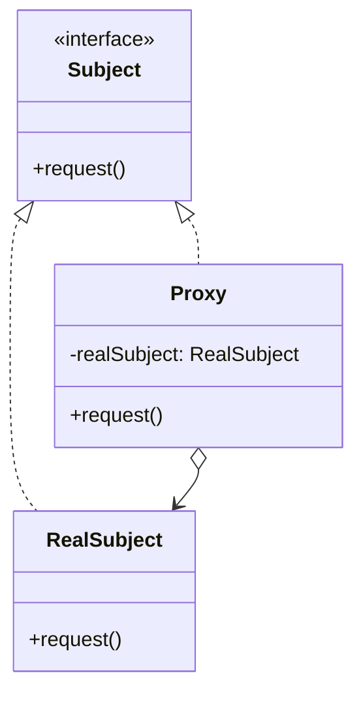
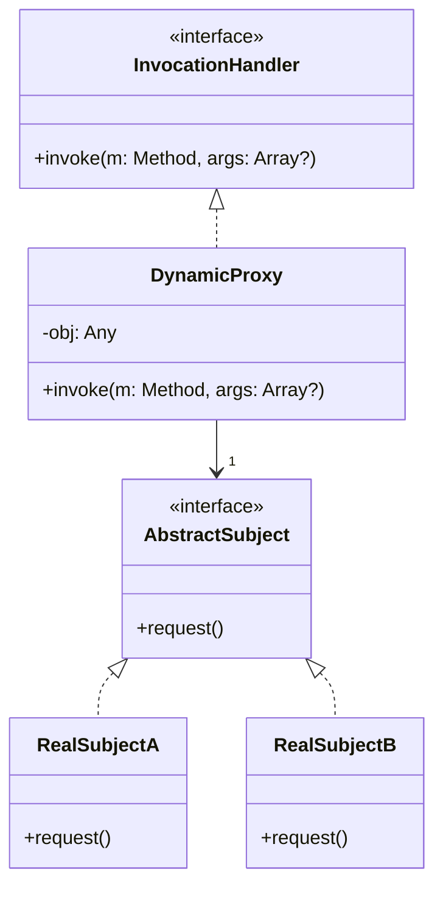

# 代理模式

解释：通过`Proxy`对`RealSubject`进行间接访问，符合`依赖倒置原则`和`迪米特法则`

## 角色介绍
- **Subject（抽象主题）**: 定义了RealSubject和Proxy的共同接口，这样就可以在任何使用RealSubject的地方使用Proxy。
- **RealSubject（真实主题）**: 定义了Proxy所代表的真实实体。
- **Proxy（代理）**: 保存一个引用使得代理可以访问实体，并提供一个与Subject接口相同的接口，这样代理就可以用来替代实体。

### 普通代理模式



```kotlin
package com.pattern.proxy

interface Subject {
    fun request()
}

class RealSubject : Subject {
    override fun request() {
        println("RealSubject request")
    }
}

// 代理
class Proxy : Subject {
    private val realSubject = RealSubject()

    override fun request() {
        println("Proxy: Pre-processing before real subject.")
        realSubject.request() // 调用真实主题的方法
        println("Proxy: Post-processing after real subject.")
    }
}

fun main() {
    // 只依赖于主题接口
    val subject: Subject = Proxy()
    subject.request() // 调用代理的方法
}
```

### 动态代理模式

解释：使用`Java反射库`中的`Method`方法，在使用时传入`真实主题`，设计时只需要`依赖抽象主题`和`InvocationHandler类`



```kotlin
package com.pattern.dynamicProxy

import java.lang.reflect.InvocationTargetException
import java.lang.reflect.Method

// 抽象主题接口
interface AbstractSubject {
    fun request()
}

// 真实主题 A
class RealSubjectA : AbstractSubject {
    override fun request() {
        println("RealSubjectA: Handling request.")
    }
}

// 真实主题 B
class RealSubjectB : AbstractSubject {
    override fun request() {
        println("RealSubjectB: Handling request.")
    }
}

// InvocationHandler 接口
interface InvocationHandler {
    @Throws(InvocationTargetException::class, IllegalAccessException::class)
    fun invoke(m: Method, args: Array<Any>?)
}

// DynamicProxy 类
class DynamicProxy(private val obj: Any) : InvocationHandler {
    override fun invoke(m: Method, args: Array<Any>?) {
        println("Proxy: Pre-processing before real subject.")
        // 调用真实主题的方法
        m.invoke(obj, args)
        println("Proxy: Post-processing after real subject.")
    }
}

fun main() {
    val mySubject: AbstractSubject = RealSubjectA()
    val myProxy = DynamicProxy(mySubject)
    // 获取 request 方法的引用
    val method = mySubject.javaClass.getMethod("request")
    // 调用 invoke 方法
    myProxy.invoke(method, null)
}
```

