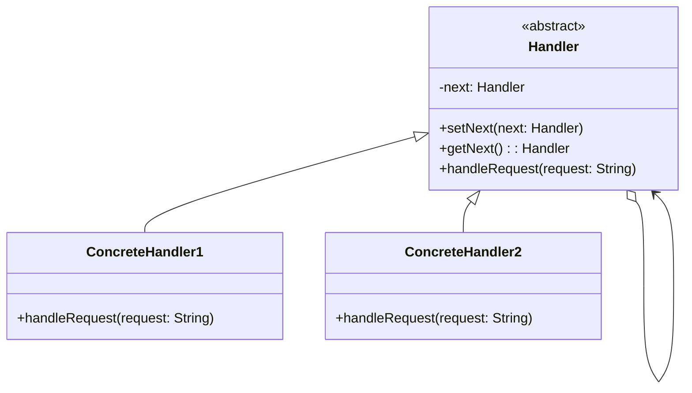

# 职责链模式

解释：通过`抽象处理者`为`具体处理者`创建链式调用，按照`链式短路`特征进行处理。职责链模式使多个对象都有机会处理请求，从而避免请求的发送者和接收者之间的耦合关系。

## 角色介绍
- **Handler（抽象处理者）**: 定义一个处理请求的接口，并实现后继链（successor chain）。
- **ConcreteHandler（具体处理者）**: 处理它所负责的请求，可访问它的后继者，如果可处理该请求，就处理之；否则将该请求转发给它的后继者。
- **Client（客户端）**: 向链上的具体处理者对象提交请求。



### 职责链模式的优点
1. **降低耦合度**：将请求的发送者和接收者解耦。
2. **增强了给对象指派职责的灵活性**：通过改变链内的成员或调动它们的次序，允许动态地新增或删除责任。
3. **增加新的请求处理类很方便**：无须修改原有代码，只需要在客户端重新建链即可。

```kotlin
fun main() {
    //组装责任链
    val handler1 = ConcreteHandler1()
    val handler2 = ConcreteHandler2()
    handler1.setNext(handler2)
    //提交请求
    handler1.handleRequest("two")
}

//抽象处理者角色
abstract class Handler {
    private var next: Handler? = null
    
    fun setNext(next: Handler) {
        this.next = next
    }
    
    fun getNext(): Handler? {
        return this.next
    }
    
    //处理请求的方法
    abstract fun handleRequest(request: String)
}

//具体处理者角色1
class ConcreteHandler1 : Handler() {
    override fun handleRequest(request: String) {
        if (request == "one") {
            println("具体处理者1负责处理该请求！")
        } else {
            getNext()?.handleRequest(request) ?: println("没有人处理该请求！")
        }
    }
}

//具体处理者角色2
class ConcreteHandler2 : Handler() {
    override fun handleRequest(request: String) {
        if (request == "two") {
            println("具体处理者2负责处理该请求！")
        } else {
            getNext()?.handleRequest(request) ?: println("没有人处理该请求！")
        }
    }
}
```

