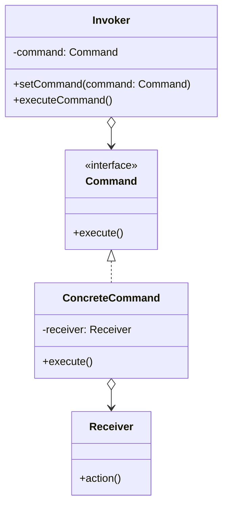

# 命令模式

解释：将一个请求封装为一个对象，从而使你可用不同的请求对客户进行参数化，对请求排队或记录请求日志，以及支持可撤销的操作。

## 角色介绍
- **Command（命令）**: 声明执行操作的接口。
- **ConcreteCommand（具体命令）**: 将一个接收者对象绑定于一个动作，调用接收者相应的操作，以实现Execute。
- **Invoker（调用者）**: 要求该命令执行这个请求。
- **Receiver（接收者）**: 知道如何实施与执行一个请求相关的操作。
- **Client（客户端）**: 创建一个具体命令对象并设定它的接收者。



```kotlin
// 接收者
class Receiver {
    fun action() {
        println("接收者执行操作")
    }
}

// 命令接口
interface Command {
    fun execute()
}

// 具体命令
class ConcreteCommand(private val receiver: Receiver) : Command {
    override fun execute() {
        println("具体命令执行")
        receiver.action()
    }
}

// 调用者
class Invoker {
    private lateinit var command: Command
    
    fun setCommand(command: Command) {
        this.command = command
    }
    
    fun executeCommand() {
        println("调用者执行命令")
        command.execute()
    }
}

fun main() {
    // 创建接收者
    val receiver = Receiver()
    // 创建具体命令并设置接收者
    val command: Command = ConcreteCommand(receiver)
    // 创建调用者并设置命令
    val invoker = Invoker()
    invoker.setCommand(command)
    // 执行命令
    invoker.executeCommand()
}
```

### 命令模式的扩展

#### 可撤销的命令