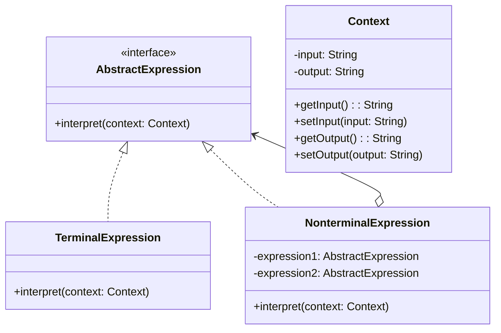

# 解释器模式

解释：给定一个语言，定义它的文法的一种表示，并定义一个解释器，这个解释器使用该表示来解释语言中的句子。

## 角色介绍
- **AbstractExpression（抽象表达式）**: 声明一个抽象的解释操作，这个接口为抽象语法树中所有的节点所共享。
- **TerminalExpression（终结符表达式）**: 实现与文法中的终结符相关联的解释操作。
- **NonterminalExpression（非终结符表达式）**: 对文法中的每一条规则，都需要一个具体的非终结符表达式类。
- **Context（环境）**: 包含解释器之外的一些全局信息。
- **Client（客户端）**: 构建表示该文法定义的语言中一个特定的句子的抽象语法树。该抽象语法树由NonterminalExpression和TerminalExpression的实例装配而成。



```kotlin
// 环境类
class Context {
    private var input: String = ""
    private var output: String = ""
    
    fun getInput(): String = input
    
    fun setInput(input: String) {
        this.input = input
    }
    
    fun getOutput(): String = output
    
    fun setOutput(output: String) {
        this.output = output
    }
}

// 抽象表达式
interface AbstractExpression {
    fun interpret(context: Context)
}

// 终结符表达式
class TerminalExpression(private val data: String) : AbstractExpression {
    override fun interpret(context: Context) {
        if (context.getInput().contains(data)) {
            context.setOutput("终结符解释器: 找到了 $data")
        } else {
            context.setOutput("终结符解释器: 没有找到 $data")
        }
    }
}

// 非终结符表达式
class AndExpression(private val expr1: AbstractExpression, private val expr2: AbstractExpression) : AbstractExpression {
    override fun interpret(context: Context) {
        // 先让expr1进行解释
        expr1.interpret(context)
        val result1 = context.getOutput()
        
        // 再让expr2进行解释
        expr2.interpret(context)
        val result2 = context.getOutput()
        
        // 组合两个解释结果
        context.setOutput("$result1 AND $result2")
    }
}

// 另一个非终结符表达式
class OrExpression(private val expr1: AbstractExpression, private val expr2: AbstractExpression) : AbstractExpression {
    override fun interpret(context: Context) {
        // 先让expr1进行解释
        expr1.interpret(context)
        val result1 = context.getOutput()
        
        // 再让expr2进行解释
        expr2.interpret(context)
        val result2 = context.getOutput()
        
        // 组合两个解释结果
        context.setOutput("$result1 OR $result2")
    }
}

fun main() {
    // 创建终结符表达式
    val terminal1 = TerminalExpression("A")
    val terminal2 = TerminalExpression("B")
    
    // 创建非终结符表达式
    val expression1 = AndExpression(terminal1, terminal2)
    val expression2 = OrExpression(terminal1, terminal2)
    
    // 创建上下文
    val context = Context()
    context.setInput("AB")
    
    // 解释
    println("输入: ${context.getInput()}")
    
    expression1.interpret(context)
    println("AND解释结果: ${context.getOutput()}")
    
    expression2.interpret(context)
    println("OR解释结果: ${context.getOutput()}")
}
```

### 解释器模式的应用

解释器模式在以下情况下特别有用：

1. 当有一个语言需要解释执行，并且可以将该语言中的句子表示为一个抽象语法树时。
2. 当语法比较简单，且效率不是关键问题时。
3. 当需要多次解释同一个语句时，可以缓存抽象语法树以提高性能。