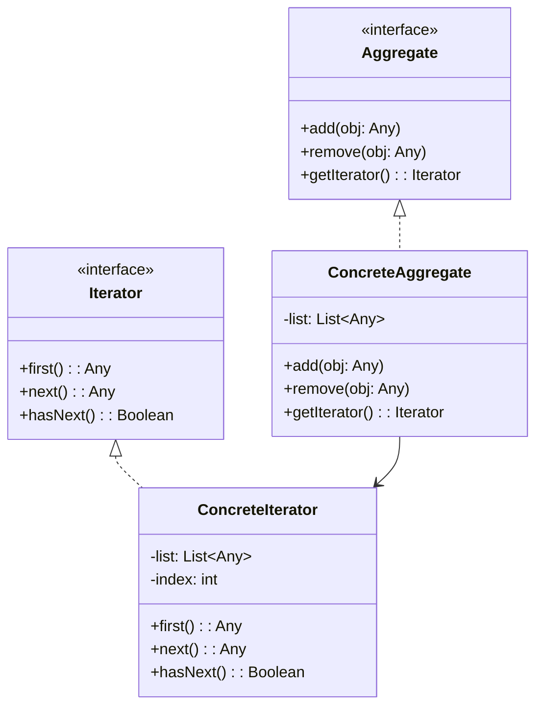

# 迭代器模式

解释：为`聚合类`实现一个可以迭代它元素，而不暴露自身的`迭代器`

## 角色介绍
- **Iterator（迭代器）**: 定义访问和遍历元素的接口。
- **ConcreteIterator（具体迭代器）**: 实现迭代器接口，对该聚合遍历时跟踪当前位置。
- **Aggregate（聚合）**: 定义创建相应迭代器对象的接口。
- **ConcreteAggregate（具体聚合）**: 实现创建相应迭代器的接口，该操作返回ConcreteIterator的一个适当的实例。



```kotlin
fun main() {
    val ag: Aggregate = ConcreteAggregate()
    ag.add("中山大学")
    ag.add("华南理工")
    ag.add("韶关学院")
    print("聚合的内容有：")
    val it: Iterator = ag.getIterator()
    while (it.hasNext()) {
        val ob = it.next()
        print("${ob.toString()}\t")
    }
    val ob = it.first()
    println("\nFirst：${ob.toString()}")
}

interface Aggregate {
    fun add(obj: Any)
    fun remove(obj: Any)
    fun getIterator(): Iterator
}

class ConcreteAggregate : Aggregate {
    private val list = mutableListOf<Any>()
    override fun add(obj: Any) {
        list.add(obj)
    }

    override fun remove(obj: Any) {
        list.remove(obj)
    }

    override fun getIterator(): Iterator {
        return ConcreteIterator(list)
    }
}

interface Iterator {
    fun first(): Any
    fun next(): Any
    fun hasNext(): Boolean
}

class ConcreteIterator(private val list: List<Any>) : Iterator {
    private var index = 0

    override fun hasNext(): Boolean {
        return index < list.size
    }

    override fun first(): Any {
        index = 0
        return list[index]
    }

    override fun next(): Any {
        var obj: Any? = null
        if (this.hasNext()) {
            obj = list[index++]
        }
        return obj!!
    }
}


```

