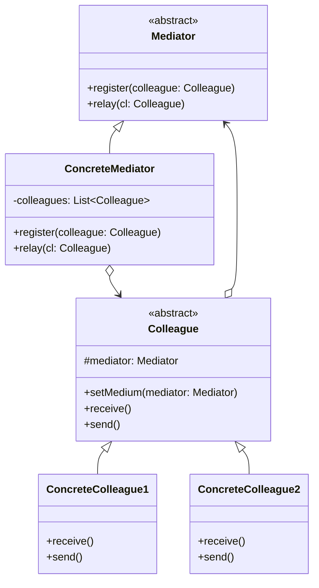

# 中介模式

解释：通过`中介者`对不同`同事`进行转发。中介者模式用一个中介对象来封装一系列的对象交互，中介者使各对象不需要显式地相互引用，从而使其耦合松散，而且可以独立地改变它们之间的交互。

## 角色介绍
- **Mediator（抽象中介者）**: 定义了同事对象到中介者对象的接口。
- **ConcreteMediator（具体中介者）**: 实现抽象中介者的方法，它需要知道所有具体同事类，并从具体同事接收消息，向具体同事对象发出命令。
- **Colleague（抽象同事类）**: 定义了同事类的接口，它只知道中介者对象，而不知道其他同事对象。
- **ConcreteColleague（具体同事类）**: 实现抽象同事类，每个具体同事类都只需要知道自己的行为，而不需要了解其他同事类的情况。



```kotlin
abstract class Mediator {
    abstract fun register(colleague: Colleague)
    abstract fun relay(cl: Colleague)
}

class ConcreteMediator : Mediator() {
    private val colleagues = mutableListOf<Colleague>()

    override fun register(colleague: Colleague) {
        if (!colleagues.contains(colleague)) {
            colleagues.add(colleague)
            colleague.setMedium(this)
        }
    }

    override fun relay(cl: Colleague) {
        for (ob in colleagues) {
            if (ob != cl) ob.receive()
        }
    }
}

abstract class Colleague {
    protected lateinit var mediator: Mediator

    fun setMedium(mediator: Mediator) {
        this.mediator = mediator
    }

    abstract fun receive()
    abstract fun send()
}

class ConcreteColleague1 : Colleague() {
    override fun receive() {
        println("具体同事类1收到请求。")
    }

    override fun send() {
        println("具体同事类1发出请求。")
        mediator.relay(this) // 请中介者转发
    }
}

class ConcreteColleague2 : Colleague() {
    override fun receive() {
        println("具体同事类2收到请求。")
    }

    override fun send() {
        println("具体同事类2发出请求。")
        mediator.relay(this) // 请中介者转发
    }
}

fun main() {
    val md: Mediator = ConcreteMediator()
    val c1: Colleague = ConcreteColleague1()
    val c2: Colleague = ConcreteColleague2()
    md.register(c1)
    md.register(c2)
    c1.send()
    println("-------------")
    c2.send()
}
```

