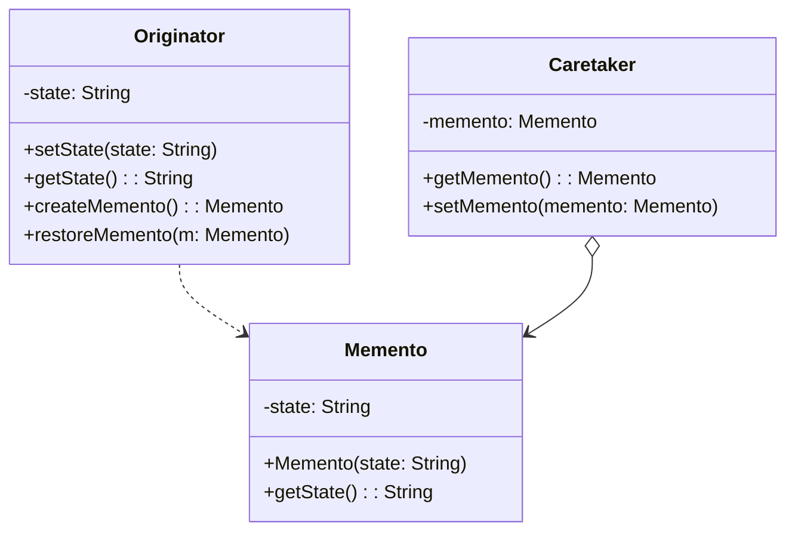

# 备忘录模式

解释：在不破坏封装性的前提下，捕获一个对象的内部状态，并在该对象之外保存这个状态，以便以后当需要时能将该对象恢复到原先保存的状态。

## 角色介绍
- **Originator（发起人）**: 创建一个备忘录，用以记录当前时刻自身的内部状态，并可使用备忘录恢复内部状态。
- **Memento（备忘录）**: 负责存储Originator的内部状态，并防止Originator以外的其他对象访问备忘录。
- **Caretaker（管理者）**: 负责保存好备忘录，不能对备忘录的内容进行操作或检查。



```kotlin
// 备忘录类
class Memento(private val state: String) {
    fun getState(): String = state
}

// 发起人类
class Originator {
    private var state: String = ""
    
    fun setState(state: String) {
        this.state = state
        println("设置状态为: $state")
    }
    
    fun getState(): String = state
    
    // 创建备忘录，保存当前状态
    fun createMemento(): Memento {
        return Memento(state)
    }
    
    // 从备忘录恢复状态
    fun restoreMemento(memento: Memento) {
        state = memento.getState()
        println("恢复状态为: $state")
    }
}

// 管理者类
class Caretaker {
    private var memento: Memento? = null
    
    fun getMemento(): Memento? = memento
    
    fun setMemento(memento: Memento) {
        this.memento = memento
    }
}

fun main() {
    // 创建发起人对象
    val originator = Originator()
    // 创建管理者对象
    val caretaker = Caretaker()
    
    // 设置发起人的状态
    originator.setState("状态1")
    // 创建备忘录并保存状态
    caretaker.setMemento(originator.createMemento())
    
    // 改变发起人状态
    originator.setState("状态2")
    println("当前状态: ${originator.getState()}")
    
    // 从备忘录恢复状态
    originator.restoreMemento(caretaker.getMemento()!!)
    println("恢复后状态: ${originator.getState()}")
}
```

### 备忘录模式的应用

备忘录模式在以下情况下特别有用：

1. 需要保存和恢复数据的相关状态场景。
2. 提供一个可回滚的操作，如撤销操作。
3. 需要保存的副本数据相对较小的情况。
4. 需要保存的状态只是部分的，而且除发起人外，不会被其他对象访问的情况。