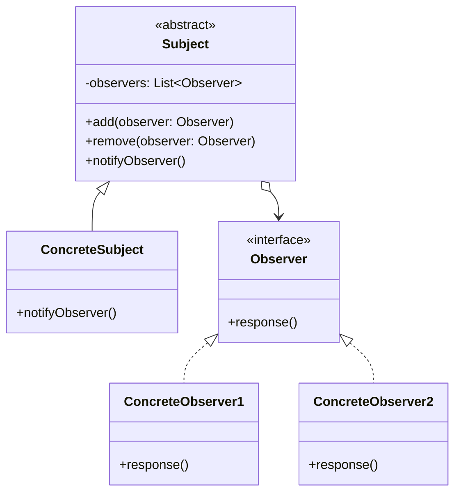

# 观察者模式

解释：当`具体主题`的内部状态`发生改变`，可以`响应`给`观察者`做出`应变`。观察者模式定义了对象间的一种一对多的依赖关系，当一个对象的状态发生改变时，所有依赖于它的对象都得到通知并被自动更新。

## 角色介绍
- **Subject（主题）**: 被观察的对象，定义了添加、删除和通知观察者的接口。
- **ConcreteSubject（具体主题）**: 具体的被观察对象，存储状态，当状态发生变化时，向观察者发出通知。
- **Observer（观察者）**: 定义了一个更新接口，使得在主题状态发生变化时能够得到通知。
- **ConcreteObserver（具体观察者）**: 实现观察者更新接口，以便在得到主题的通知时更新自身状态。



### 观察者模式的优点
1. **降低了目标与观察者之间的耦合关系**：目标与观察者之间是抽象耦合关系。
2. **支持广播通信**：被观察者发送通知，所有注册的观察者都会收到通知。
3. **符合开闭原则**：在不修改现有代码的情况下，可以引入新的观察者类。

```kotlin
abstract class Subject {
    protected val observers = mutableListOf<Observer>()

    fun add(observer: Observer) {
        observers.add(observer)
    }

    fun remove(observer: Observer) {
        observers.remove(observer)
    }

    abstract fun notifyObserver()
}

class ConcreteSubject : Subject() {

    override fun notifyObserver() {
        println("具体目标发生改变")
        for (obs in observers) {
            (obs as Observer).response()
        }
    }
}

interface Observer {
    fun response()
}

class ConcreteObserver1 : Observer {
    override fun response() {
        println("观察者1被调用")
    }
}

class ConcreteObserver2 : Observer {
    override fun response() {
        println("观察者2被调用")
    }
}

fun main() {
    val obs1: Observer = ConcreteObserver1()
    val obs2: Observer = ConcreteObserver2()
    val sub1: Subject = ConcreteSubject()
    sub1.add(obs1)
    sub1.add(obs2)
    sub1.notifyObserver()
}
```

