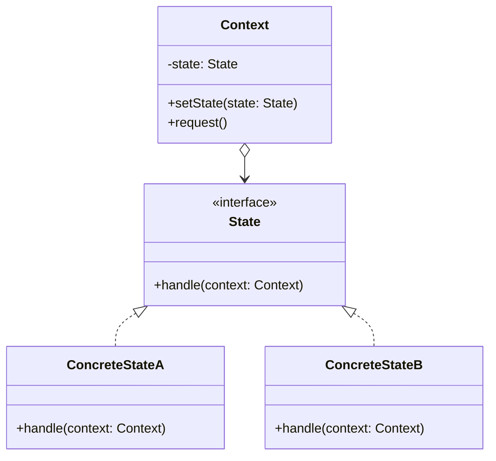

# 状态模式

解释：允许一个对象在其内部状态改变时改变它的行为，对象看起来似乎修改了它的类。

## 角色介绍
- **Context（环境）**: 维护一个对具体状态对象的引用，并将与状态相关的操作委托给当前状态对象。
- **State（抽象状态）**: 定义一个接口，用以封装与Context的一个特定状态相关的行为。
- **ConcreteState（具体状态）**: 实现抽象状态所定义的行为。



```kotlin
// 抽象状态
interface State {
    fun handle(context: Context)
}

// 具体状态A
class ConcreteStateA : State {
    override fun handle(context: Context) {
        println("当前状态是 A.")
        println("A 状态下的行为")
        context.setState(ConcreteStateB())
    }
}

// 具体状态B
class ConcreteStateB : State {
    override fun handle(context: Context) {
        println("当前状态是 B.")
        println("B 状态下的行为")
        context.setState(ConcreteStateA())
    }
}

// 环境类
class Context {
    private var state: State = ConcreteStateA()
    
    fun setState(state: State) {
        println("状态改变")
        this.state = state
    }
    
    fun request() {
        state.handle(this)
    }
}

fun main() {
    val context = Context()
    context.request()    // 输出状态A的行为，并切换到状态B
    context.request()    // 输出状态B的行为，并切换到状态A
}
```

### 状态模式的应用

状态模式在以下情况下特别有用：

1. 对象的行为取决于它的状态，并且必须在运行时根据状态改变它的行为。
2. 代码中包含大量与对象状态有关的条件语句，可以使用状态模式将条件分支转换为状态类。
3. 需要消除庞大的条件分支语句，使代码更加清晰和可维护。