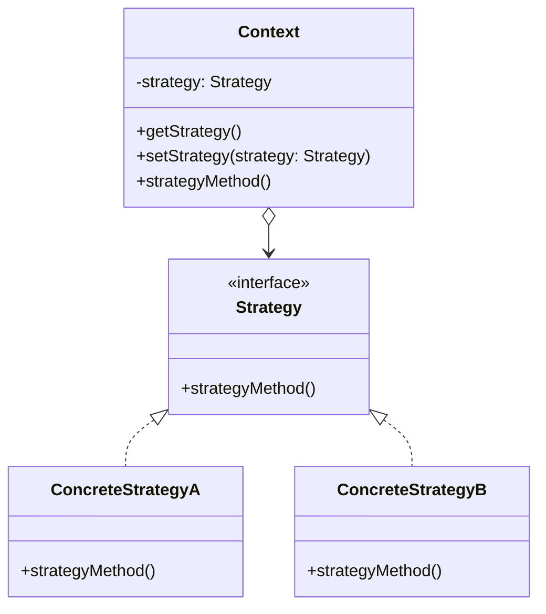

# 策略模式

解释：通过对`接口`的`不同实现`，以及对`环境类`的`调用`来`组织代码`的形式。策略模式定义了一系列算法，并将每个算法封装起来，使它们可以相互替换，且算法的变化不会影响使用算法的客户。

## 角色介绍
- **Strategy（策略）**: 定义所有支持的算法的公共接口。这是策略模式的抽象策略类，通常为接口或抽象类，定义了具体策略类需要实现的方法。
- **ConcreteStrategy（具体策略）**: 实现Strategy接口的具体算法。这些是策略模式的具体策略类，实现了抽象策略定义的接口，提供具体的算法实现。
- **Context（上下文）**: 维护一个Strategy对象的引用，并调用策略对象的相关算法。上下文类通常会有一个设置策略的方法，允许在运行时改变策略。



### 策略模式的优点
1. **算法可以自由切换**：只要实现了策略接口，就可以在运行时切换不同的策略。
2. **避免使用多重条件判断**：如果不使用策略模式，对不同的算法行为的选择将通过多重的条件语句来实现。
3. **扩展性良好**：在不修改原有代码的情况下，可以通过增加新的策略类来扩展功能。

### 策略模式的缺点
1. **策略类会增多**：每一个策略都需要一个类，当策略过多时会导致类数量剧增。
2. **所有策略类都需要对外暴露**：上下文类需要知道所有的策略类，这样才能决定使用哪个策略。

```kotlin
interface Strategy {
    fun strategyMethod()
}

class Context(private var strategy: Strategy) {
    fun getStrategy(): Strategy {
        return this.strategy
    }
    
    fun setStrategy(strategy: Strategy) {
        this.strategy = strategy
    }
    
    fun strategyMethod() {
        strategy.strategyMethod()
    }
}

class ConcreteStrategyA : Strategy {
    override fun strategyMethod() {
        println("具体策略A被使用")
    }
}

class ConcreteStrategyB : Strategy {
    override fun strategyMethod() {
        println("具体策略B被使用")
    }
}

fun main() {
    val myStrategy: Strategy = ConcreteStrategyA()
    val context = Context(myStrategy)
    context.strategyMethod()
}
```

