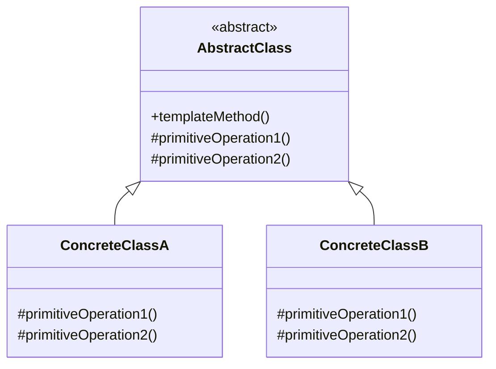

# 模板方法模式

解释：定义一个操作中的算法骨架，而将一些步骤延迟到子类中。模板方法使得子类可以不改变一个算法的结构即可重定义该算法的某些特定步骤。

## 角色介绍
- **AbstractClass（抽象类）**: 定义抽象的原语操作，具体的子类将重定义它们以实现一个算法的各个步骤，实现一个模板方法作为算法的骨架。
- **ConcreteClass（具体类）**: 实现原语操作以完成算法中与特定子类相关的步骤。



```kotlin
// 抽象类
abstract class AbstractClass {
    // 模板方法，定义算法骨架
    fun templateMethod() {
        primitiveOperation1()
        primitiveOperation2()
        if (hook()) {
            println("钩子方法返回true，执行额外操作")
        }
    }
    
    // 基本操作1，由子类实现
    protected abstract fun primitiveOperation1()
    
    // 基本操作2，由子类实现
    protected abstract fun primitiveOperation2()
    
    // 钩子方法，子类可以覆盖
    protected open fun hook(): Boolean {
        return true
    }
}

// 具体类A
class ConcreteClassA : AbstractClass() {
    override fun primitiveOperation1() {
        println("具体类A的操作1")
    }
    
    override fun primitiveOperation2() {
        println("具体类A的操作2")
    }
    
    override fun hook(): Boolean {
        return true
    }
}

// 具体类B
class ConcreteClassB : AbstractClass() {
    override fun primitiveOperation1() {
        println("具体类B的操作1")
    }
    
    override fun primitiveOperation2() {
        println("具体类B的操作2")
    }
    
    override fun hook(): Boolean {
        return false
    }
}

fun main() {
    val classA: AbstractClass = ConcreteClassA()
    val classB: AbstractClass = ConcreteClassB()
    
    println("执行具体类A的模板方法：")
    classA.templateMethod()
    
    println("\n执行具体类B的模板方法：")
    classB.templateMethod()
}
```

### 模板方法模式的应用

模板方法模式在以下情况下特别有用：

1. 一次性实现一个算法的不变部分，并将可变的行为留给子类来实现。
2. 各子类中公共的行为应被提取出来并集中到一个公共父类中以避免代码重复。
3. 控制子类扩展。模板方法只在特定点调用"hook"操作，这样就只允许在这些点进行扩展。