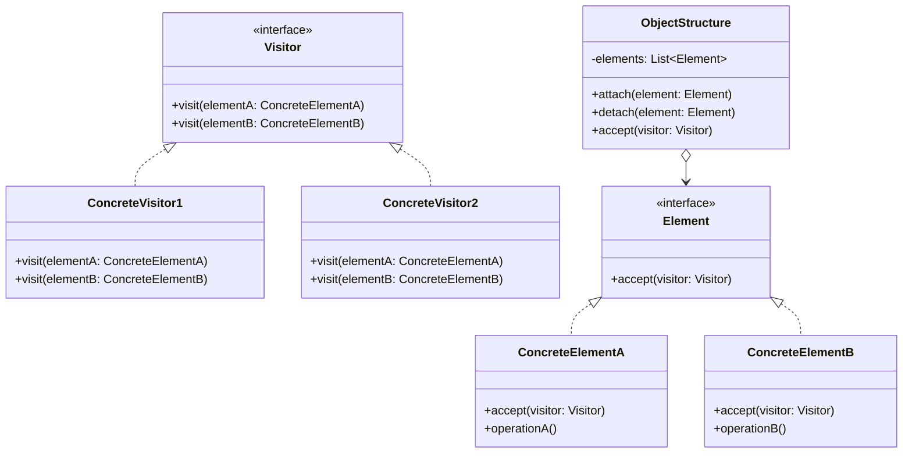

# 访问者模式

解释：表示一个作用于某对象结构中的各元素的操作，它使你可以在不改变各元素的类的前提下定义作用于这些元素的新操作。

## 角色介绍
- **Visitor（抽象访问者）**: 声明了一个或多个访问操作，形成所有的具体元素都必须实现的接口。
- **ConcreteVisitor（具体访问者）**: 实现抽象访问者声明的接口，为每一个具体元素类实现访问操作。
- **Element（抽象元素）**: 声明一个接受访问者的方法，该方法通常以一个抽象访问者作为参数。
- **ConcreteElement（具体元素）**: 实现抽象元素接口，实现接受访问者的方法。
- **ObjectStructure（对象结构）**: 能够枚举它的元素，可以提供一个高层的接口允许访问者访问它的元素。



```kotlin
// 抽象访问者
interface Visitor {
    fun visit(elementA: ConcreteElementA)
    fun visit(elementB: ConcreteElementB)
}

// 具体访问者1
class ConcreteVisitor1 : Visitor {
    override fun visit(elementA: ConcreteElementA) {
        println("具体访问者1访问${elementA.operationA()}")
    }

    override fun visit(elementB: ConcreteElementB) {
        println("具体访问者1访问${elementB.operationB()}")
    }
}

// 具体访问者2
class ConcreteVisitor2 : Visitor {
    override fun visit(elementA: ConcreteElementA) {
        println("具体访问者2访问${elementA.operationA()}")
    }

    override fun visit(elementB: ConcreteElementB) {
        println("具体访问者2访问${elementB.operationB()}")
    }
}

// 抽象元素
interface Element {
    fun accept(visitor: Visitor)
}

// 具体元素A
class ConcreteElementA : Element {
    override fun accept(visitor: Visitor) {
        visitor.visit(this)
    }

    fun operationA(): String {
        return "元素A"
    }
}

// 具体元素B
class ConcreteElementB : Element {
    override fun accept(visitor: Visitor) {
        visitor.visit(this)
    }

    fun operationB(): String {
        return "元素B"
    }
}

// 对象结构
class ObjectStructure {
    private val elements = mutableListOf<Element>()

    fun attach(element: Element) {
        elements.add(element)
    }

    fun detach(element: Element) {
        elements.remove(element)
    }

    fun accept(visitor: Visitor) {
        for (element in elements) {
            element.accept(visitor)
        }
    }
}

fun main() {
    // 创建对象结构
    val objectStructure = ObjectStructure()
    objectStructure.attach(ConcreteElementA())
    objectStructure.attach(ConcreteElementB())

    // 创建访问者
    val visitor1: Visitor = ConcreteVisitor1()
    val visitor2: Visitor = ConcreteVisitor2()

    // 接受访问
    println("访问者1访问:")
    objectStructure.accept(visitor1)
    println("\n访问者2访问:")
    objectStructure.accept(visitor2)
}
```

### 访问者模式的应用

访问者模式在以下情况下特别有用：

1. 一个对象结构包含很多类对象，它们有不同的接口，而你想对这些对象实施一些依赖于其具体类的操作。
2. 需要对一个对象结构中的对象进行很多不同的并且不相关的操作，而你想避免让这些操作"污染"这些对象的类。
3. 定义对象结构的类很少改变，但经常需要在此结构上定义新的操作。