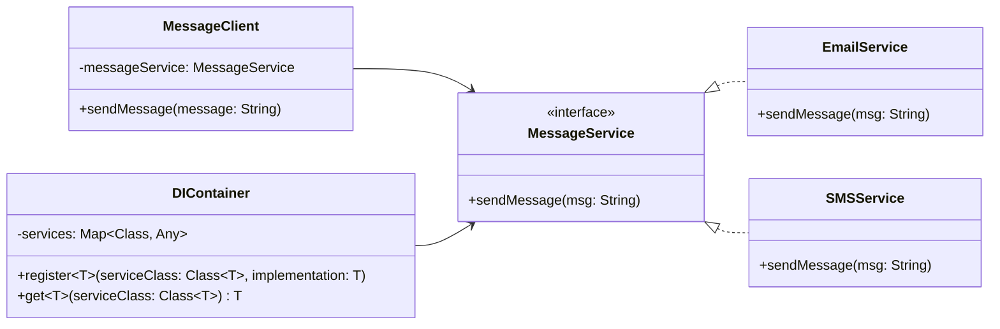

# 依赖注入模式




## 模式介绍
依赖注入（Dependency Injection，简称DI）是一种设计模式，它允许我们将对象的创建和依赖关系的处理从对象的使用中分离出来。这种模式可以提高代码的可维护性、可测试性和灵活性。

## 角色介绍
1. **服务（Service）**：被注入的依赖对象
2. **客户端（Client）**：依赖于服务的对象
3. **注入器（Injector）**：负责创建和注入依赖的对象

## 代码示例

```kotlin
// 1. 定义服务接口
interface MessageService {
    fun sendMessage(msg: String)
}

// 2. 实现具体服务
class EmailService : MessageService {
    override fun sendMessage(msg: String) {
        println("Sending email: $msg")
    }
}

class SMSService : MessageService {
    override fun sendMessage(msg: String) {
        println("Sending SMS: $msg")
    }
}

// 3. 客户端类
class MessageClient(private val messageService: MessageService) {
    fun sendMessage(message: String) {
        messageService.sendMessage(message)
    }
}

// 4. 简单的依赖注入容器
class DIContainer {
    private val services = mutableMapOf<Class<*>, Any>()
    
    fun <T : Any> register(serviceClass: Class<T>, implementation: T) {
        services[serviceClass] = implementation
    }
    
    @Suppress("UNCHECKED_CAST")
    fun <T : Any> get(serviceClass: Class<T>): T {
        return services[serviceClass] as T
    }
}

// 使用示例
fun main() {
    // 创建DI容器
    val container = DIContainer()
    
    // 注册服务
    container.register(MessageService::class.java, EmailService())
    
    // 获取服务并创建客户端
    val messageService = container.get(MessageService::class.java)
    val client = MessageClient(messageService)
    
    // 使用客户端
    client.sendMessage("Hello, DI Pattern!")
    
    // 切换实现
    container.register(MessageService::class.java, SMSService())
    val newMessageService = container.get(MessageService::class.java)
    val newClient = MessageClient(newMessageService)
    newClient.sendMessage("Hello again!")
}
```

## 应用场景
1. **模块解耦**：当一个系统需要降低模块间的耦合度时。
2. **单元测试**：在测试时可以方便地注入mock对象。
3. **配置切换**：需要在运行时动态切换不同实现时。
4. **框架开发**：许多现代框架（如Spring、Koin等）都使用依赖注入作为核心机制。

## 优点
1. **解耦**：将对象的创建与使用分离。
2. **可测试性**：便于进行单元测试。
3. **可维护性**：集中管理对象的创建和依赖关系。
4. **灵活性**：可以轻松切换具体实现。

## 缺点
1. **复杂性**：引入了额外的接口和类。
2. **学习成本**：理解和使用DI容器需要一定学习成本。
3. **性能开销**：动态创建和注入对象可能带来少量性能开销。

## 注意事项
1. 避免过度使用依赖注入，只在确实需要解耦的地方使用。
2. 注意循环依赖问题。
3. 合理规划接口设计，避免接口过于复杂。