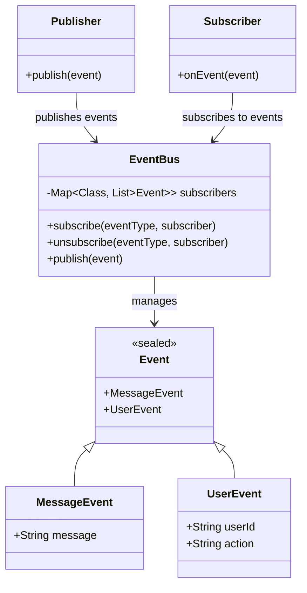

# 事件总线模式



## 模式介绍

事件总线（Event Bus）是一种消息发布-订阅模式的实现，它提供了一种集中式的事件处理机制，用于在不同组件之间传递事件，实现组件间的解耦通信。

## 角色介绍

1. **事件（Event）**：包含需要传递的数据的消息对象
2. **发布者（Publisher）**：发送事件的对象
3. **订阅者（Subscriber）**：接收并处理事件的对象
4. **事件总线（EventBus）**：负责事件的注册、分发和管理

## 代码示例

```kotlin
// 1. 定义事件类
sealed class Event {
    data class MessageEvent(val message: String) : Event()
    data class UserEvent(val userId: String, val action: String) : Event()
}

// 2. 事件总线实现
class EventBus private constructor() {
    private val subscribers = mutableMapOf<Class<out Event>, MutableList<(Event) -> Unit>>()
  
    companion object {
        val instance = EventBus()
    }
  
    fun <T : Event> subscribe(eventType: Class<T>, subscriber: (T) -> Unit) {
        val wrappedSubscriber: (Event) -> Unit = { event ->
            if (eventType.isInstance(event)) {
                @Suppress("UNCHECKED_CAST")
                subscriber(event as T)
            }
        }
        subscribers.getOrPut(eventType) { mutableListOf() }.add(wrappedSubscriber)
    }
  
    fun <T : Event> unsubscribe(eventType: Class<T>, subscriber: (T) -> Unit) {
        subscribers[eventType]?.removeIf { it.toString() == subscriber.toString() }
    }
  
    fun publish(event: Event) {
        subscribers[event::class.java]?.forEach { subscriber ->
            subscriber(event)
        }
    }
}

// 3. 示例组件
class MessageComponent {
    init {
        // 订阅消息事件
        EventBus.instance.subscribe(Event.MessageEvent::class.java) { event ->
            println("收到消息: ${event.message}")
        }
    }
  
    fun sendMessage(message: String) {
        EventBus.instance.publish(Event.MessageEvent(message))
    }
}

class UserComponent {
    init {
        // 订阅用户事件
        EventBus.instance.subscribe(Event.UserEvent::class.java) { event ->
            println("用户${event.userId}执行了${event.action}操作")
        }
    }
  
    fun performUserAction(userId: String, action: String) {
        EventBus.instance.publish(Event.UserEvent(userId, action))
    }
}

// 使用示例
fun main() {
    val messageComponent = MessageComponent()
    val userComponent = UserComponent()
  
    // 发送消息事件
    messageComponent.sendMessage("Hello, Event Bus!")
  
    // 发送用户事件
    userComponent.performUserAction("user123", "登录")
}
```

## 应用场景

1. **组件解耦**：当系统中多个组件需要通信，但希望它们保持松耦合时。
2. **跨模块通信**：在大型应用中实现不同模块间的事件传递。
3. **UI更新**：在界面组件需要响应数据变化时。
4. **插件系统**：实现插件之间的通信和交互。

## 优点

1. **解耦性**：发布者和订阅者之间完全解耦。
2. **灵活性**：可以动态添加或移除订阅者。
3. **扩展性**：易于添加新的事件类型和处理器。
4. **简化通信**：提供了统一的事件处理机制。

## 缺点

1. **调试难度**：事件流程不易跟踪和调试。
2. **内存泄漏**：如果没有正确取消订阅，可能导致内存泄漏。
3. **性能开销**：频繁的事件发布和订阅可能带来性能问题。

## 注意事项

1. 及时取消不需要的事件订阅。
2. 避免过度使用事件总线，导致代码难以维护。
3. 合理设计事件类型，避免事件泛滥。
4. 考虑事件处理的线程安全问题。
