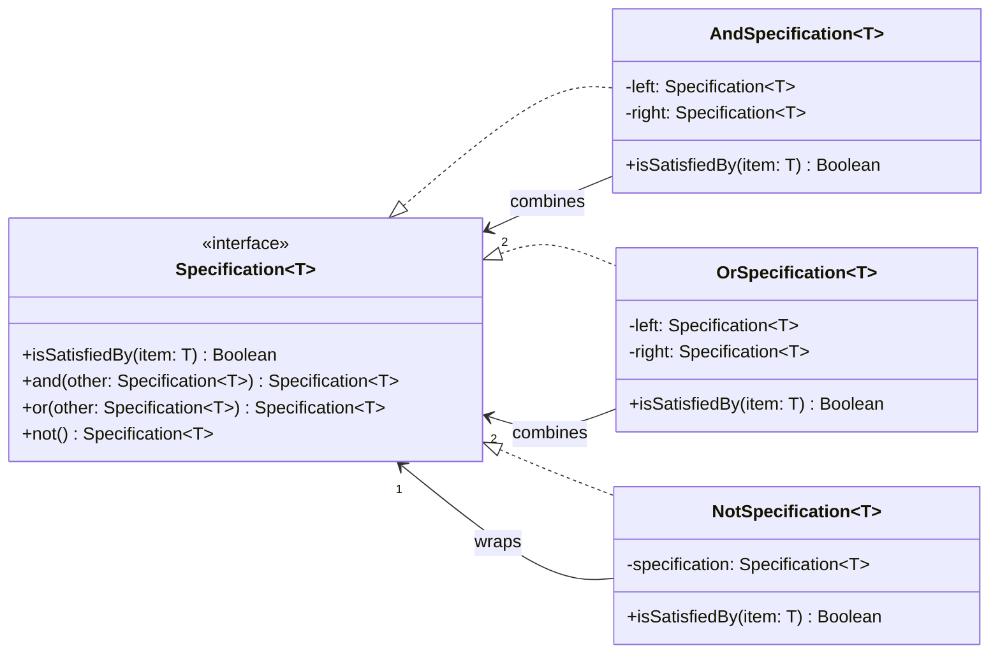

# 规格模式




## 模式介绍
规格模式（Specification Pattern）是一种业务规则模式，它将业务规则封装在单独的规格对象中，使得这些规则可以被组合、重用和单独测试。这种模式在领域驱动设计（DDD）中特别有用。

## 角色介绍
1. **规格（Specification）**：定义业务规则的接口
2. **具体规格（Concrete Specification）**：实现特定业务规则的类
3. **组合规格（Composite Specification）**：组合多个规格的类
4. **目标对象（Target）**：被规格评估的对象

## 代码示例

```kotlin
// 1. 定义规格接口
interface Specification<T> {
    fun isSatisfiedBy(item: T): Boolean
    
    // 组合操作符
    infix fun and(other: Specification<T>): Specification<T> = AndSpecification(this, other)
    infix fun or(other: Specification<T>): Specification<T> = OrSpecification(this, other)
    fun not(): Specification<T> = NotSpecification(this)
}

// 2. 组合规格实现
class AndSpecification<T>(
    private val left: Specification<T>,
    private val right: Specification<T>
) : Specification<T> {
    override fun isSatisfiedBy(item: T): Boolean =
        left.isSatisfiedBy(item) && right.isSatisfiedBy(item)
}

class OrSpecification<T>(
    private val left: Specification<T>,
    private val right: Specification<T>
) : Specification<T> {
    override fun isSatisfiedBy(item: T): Boolean =
        left.isSatisfiedBy(item) || right.isSatisfiedBy(item)
}

class NotSpecification<T>(
    private val specification: Specification<T>
) : Specification<T> {
    override fun isSatisfiedBy(item: T): Boolean =
        !specification.isSatisfiedBy(item)
}

// 3. 示例：商品筛选规格
data class Product(
    val name: String,
    val price: Double,
    val stock: Int,
    val category: String
)

// 具体规格实现
class PriceSpecification(private val maxPrice: Double) : Specification<Product> {
    override fun isSatisfiedBy(item: Product): Boolean =
        item.price <= maxPrice
}

class StockSpecification(private val minStock: Int) : Specification<Product> {
    override fun isSatisfiedBy(item: Product): Boolean =
        item.stock >= minStock
}

class CategorySpecification(private val category: String) : Specification<Product> {
    override fun isSatisfiedBy(item: Product): Boolean =
        item.category == category
}

// 使用示例
fun main() {
    val products = listOf(
        Product("手机", 2999.0, 100, "电子产品"),
        Product("笔记本", 5999.0, 50, "电子产品"),
        Product("书籍", 59.0, 200, "图书")
    )
    
    // 创建规格
    val affordable = PriceSpecification(3000.0)
    val inStock = StockSpecification(10)
    val isElectronic = CategorySpecification("电子产品")
    
    // 组合规格
    val availableElectronics = affordable and inStock and isElectronic
    
    // 应用规格
    val availableProducts = products.filter { availableElectronics.isSatisfiedBy(it) }
    println("可用的电子产品：")
    availableProducts.forEach { println("${it.name} - ￥${it.price} - 库存：${it.stock}") }
}
```

## 应用场景
1. **复杂查询条件**：当需要构建灵活的查询条件时。
2. **业务规则验证**：封装和组合多个业务规则。
3. **领域驱动设计**：在DDD中表达领域规则和约束。
4. **过滤器链**：构建可重用的过滤器组合。

## 优点
1. **单一职责**：每个规格类只负责一个特定的业务规则。
2. **可组合性**：规格可以通过逻辑运算符组合成更复杂的规则。
3. **可重用性**：规格可以在不同上下文中重用。
4. **可测试性**：每个规格都可以独立测试。

## 缺点
1. **复杂性**：对于简单的业务规则可能显得过于复杂。
2. **性能开销**：组合规格可能导致多次遍历集合。
3. **学习曲线**：理解和正确使用规格模式需要一定时间。

## 注意事项
1. 避免创建过于复杂的规格组合。
2. 注意规格组合的性能影响。
3. 保持规格类的单一职责。
4. 合理命名规格类，使其含义明确。