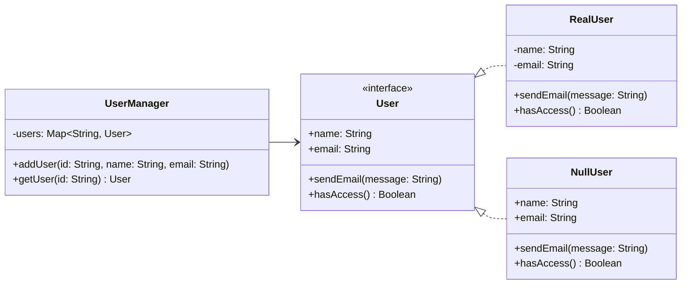

# 空对象模式




## 模式介绍
空对象模式（Null Object Pattern）是一种行为设计模式，它提供了一个默认对象来代替空引用。这种模式可以避免空指针异常，并为空对象定义一个默认的无害行为。

## 角色介绍
1. **抽象类（Abstract）**：定义接口和一些默认行为
2. **真实对象（RealObject）**：实现抽象类定义的接口
3. **空对象（NullObject）**：提供无害的默认实现

## 代码示例

```kotlin
// 1. 定义抽象用户接口
interface User {
    val name: String
    val email: String
    fun sendEmail(message: String)
    fun hasAccess(): Boolean
}

// 2. 实现真实用户类
class RealUser(override val name: String, override val email: String) : User {
    override fun sendEmail(message: String) {
        println("发送邮件到 $email: $message")
    }
    
    override fun hasAccess(): Boolean = true
}

// 3. 实现空用户类
class NullUser : User {
    override val name: String = "游客"
    override val email: String = ""
    
    override fun sendEmail(message: String) {
        // 无操作，静默失败
    }
    
    override fun hasAccess(): Boolean = false
}

// 4. 用户管理类
class UserManager {
    private val users = mutableMapOf<String, User>()
    
    fun addUser(id: String, name: String, email: String) {
        users[id] = RealUser(name, email)
    }
    
    fun getUser(id: String): User {
        return users[id] ?: NullUser()
    }
}

// 使用示例
fun main() {
    val userManager = UserManager()
    
    // 添加一个真实用户
    userManager.addUser("1", "张三", "zhangsan@example.com")
    
    // 获取并使用用户对象
    val user1 = userManager.getUser("1")
    val user2 = userManager.getUser("2") // 返回 NullUser
    
    // 使用用户对象
    println("用户1: ${user1.name}")
    println("用户2: ${user2.name}")
    
    if (user1.hasAccess()) {
        user1.sendEmail("你好，这是一条测试消息")
    }
    
    if (user2.hasAccess()) {
        user2.sendEmail("这条消息不会被发送")
    }
}
```

## 应用场景
1. **处理可选依赖**：当系统的某些部分是可选的时候。
2. **处理默认行为**：需要为空值提供默认行为时。
3. **简化空值检查**：避免频繁的空值检查代码。
4. **测试替身**：在测试中提供一个无操作的对象。

## 优点
1. **避免空指针异常**：不需要显式的空值检查。
2. **简化代码**：减少条件判断语句。
3. **提供默认行为**：为空对象定义合理的默认行为。
4. **保持接口一致性**：空对象和真实对象实现相同的接口。

## 缺点
1. **隐藏错误**：可能掩盖真正的问题。
2. **调试困难**：错误可能被默默地忽略。
3. **增加类的数量**：需要为每个类创建对应的空对象类。

## 注意事项
1. 确保空对象的行为是真正无害的。
2. 不要在空对象中抛出异常。
3. 考虑是否真的需要隐藏空值，有时显式处理可能更好。
4. 合理设计空对象的默认行为。