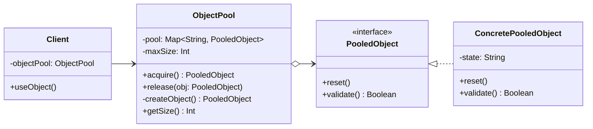

# 对象池模式



## 角色介绍
1. **对象池（ObjectPool）**：维护一个对象池，管理对象的创建、获取和释放
2. **池化对象（PooledObject）**：被池化的对象接口，定义对象重置和验证方法
3. **具体池化对象（ConcretePooledObject）**：实现池化对象接口的具体类
4. **客户端（Client）**：使用对象池获取和释放对象的客户端

## 模式说明
对象池模式是一种创建型设计模式，用于管理和重用对象，以减少对象创建和销毁的开销。当对象的创建成本较高，而且需要频繁创建和销毁对象时，使用对象池可以显著提高系统性能。

### 主要特点
1. **对象重用**：避免重复创建和销毁对象
2. **性能优化**：减少内存分配和垃圾回收的开销
3. **资源控制**：限制对象的最大数量，防止资源耗尽
4. **状态管理**：确保重用对象时状态正确重置

### 适用场景
1. 对象创建成本高（如数据库连接、线程等）
2. 需要频繁创建和销毁对象
3. 对象在某个时间段内使用频率高
4. 需要限制系统中某类对象的最大数量

### 优点
1. 提高性能，减少对象创建和销毁的开销
2. 控制资源使用，避免资源耗尽
3. 提供预测性能，因为对象已预先创建

### 缺点
1. 内存占用可能增加，因为池中的对象即使不用也会占用内存
2. 增加了系统复杂度
3. 可能导致对象状态管理的问题

### 实现要点
1. **对象池大小控制**：根据实际需求设置合适的池大小
2. **对象状态重置**：确保归还对象时正确重置状态
3. **线程安全考虑**：在多线程环境下需要同步访问
4. **对象有效性验证**：检查对象是否可用，无效对象及时清理
5. **超时机制**：避免对象被永久占用

## 代码示例

```kotlin
// 1. 定义池化对象接口
interface PooledObject {
    fun reset()
    fun validate(): Boolean
    fun doWork()
}

// 2. 实现具体的池化对象
class DatabaseConnection(private val id: Int) : PooledObject {
    private var isConnected = false
    
    override fun reset() {
        isConnected = false
        println("Connection $id reset")
    }
    
    override fun validate(): Boolean {
        return true // 简化示例，实际应检查连接是否有效
    }
    
    override fun doWork() {
        if (!isConnected) {
            // 模拟连接耗时
            Thread.sleep(100)
            isConnected = true
            println("Connection $id established")
        }
        println("Connection $id executing query")
    }
}

// 3. 实现对象池
class ObjectPool<T : PooledObject>(private val maxSize: Int, private val factory: (Int) -> T) {
    private val available = mutableListOf<T>()
    private val inUse = mutableSetOf<T>()
    
    @Synchronized
    fun acquire(): T {
        if (available.isEmpty() && inUse.size < maxSize) {
            // 创建新对象
            val obj = factory(inUse.size + available.size)
            available.add(obj)
        }
        
        if (available.isEmpty()) {
            throw IllegalStateException("No object available and pool is at maximum capacity")
        }
        
        val obj = available.removeAt(available.lastIndex)
        inUse.add(obj)
        return obj
    }
    
    @Synchronized
    fun release(obj: T) {
        if (inUse.remove(obj)) {
            obj.reset()
            if (obj.validate()) {
                available.add(obj)
            }
        }
    }
    
    fun getStats(): String = "Available: ${available.size}, In use: ${inUse.size}"
}

// 使用示例
fun main() {
    // 创建最大容量为3的数据库连接池
    val pool = ObjectPool(3) { id -> DatabaseConnection(id) }
    
    println("Initial pool stats: ${pool.getStats()}")
    
    // 模拟使用连接
    val conn1 = pool.acquire()
    println("After acquiring first connection: ${pool.getStats()}")
    conn1.doWork()
    
    val conn2 = pool.acquire()
    println("After acquiring second connection: ${pool.getStats()}")
    conn2.doWork()
    
    // 释放连接
    pool.release(conn1)
    println("After releasing first connection: ${pool.getStats()}")
    
    // 重新使用已释放的连接
    val conn3 = pool.acquire()
    println("After acquiring third connection: ${pool.getStats()}")
    conn3.doWork()
    
    // 释放所有连接
    pool.release(conn2)
    pool.release(conn3)
    println("Final pool stats: ${pool.getStats()}")
}
```