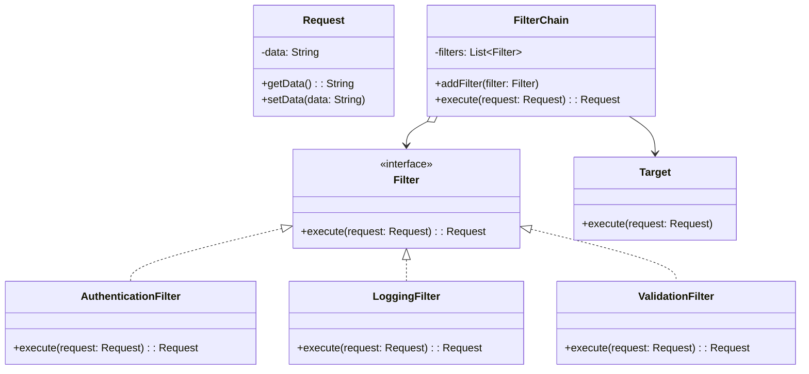
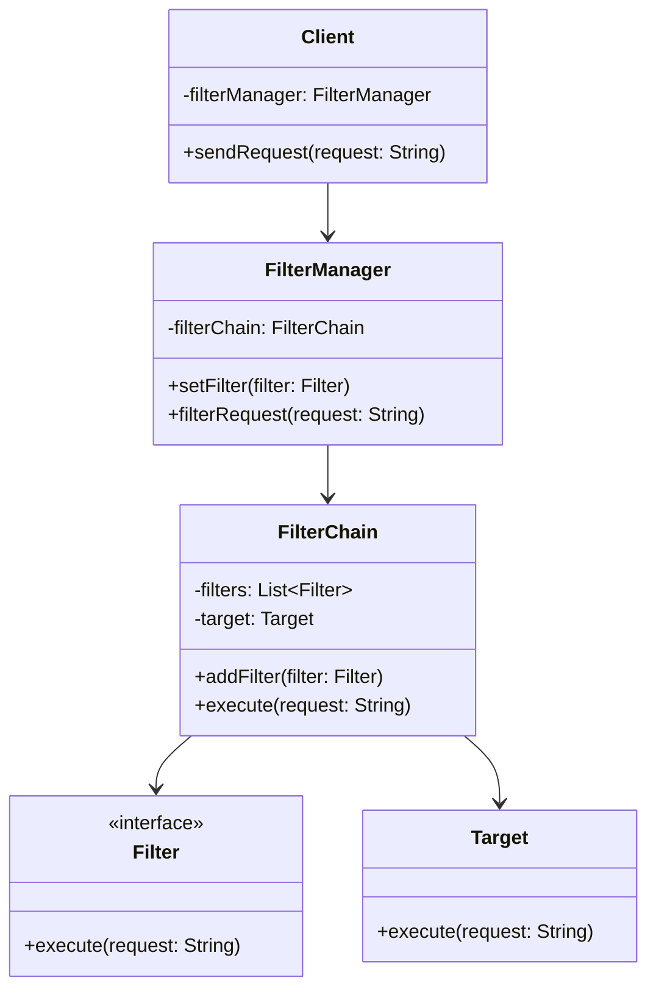

# 过滤器模式

过滤器模式（Filter Pattern）允许开发人员使用不同的标准来过滤一组对象，通过逻辑运算以解耦的方式把它们连接起来。这种模式在处理请求和响应时特别有用。

## 角色介绍

1. **过滤器接口（Filter）**：定义了执行过滤操作的标准接口，声明过滤方法
2. **具体过滤器（ConcreteFilter）**：实现过滤器接口，完成特定的过滤功能，如身份验证、日志记录、数据验证等
3. **过滤管理器（FilterChain）**：维护过滤器链，管理多个过滤器的执行顺序，串联各个过滤器
4. **目标对象（Target）**：被过滤器处理的请求或数据对象
5. **客户端（Client）**：初始化过滤器链并触发过滤器的执行

### 拦截过滤器模式
拦截过滤器是过滤器模式的一个变体，主要用于Web应用程序中处理请求和响应。它在请求到达目标资源之前或响应返回客户端之前进行预处理和后处理。额外角色包括：

1. **拦截过滤器（InterceptingFilter）**：在请求处理的不同阶段进行拦截和处理
2. **过滤器配置（FilterConfig）**：包含过滤器的配置信息
3. **过滤器管理器（FilterManager）**：管理过滤器的注册和调用

## 类图



## 代码实现

```kotlin
// 请求对象
data class Request(var data: String)

// 过滤器接口
interface Filter {
    fun execute(request: Request): Request
}

// 认证过滤器
class AuthenticationFilter : Filter {
    override fun execute(request: Request): Request {
        println("认证过滤器: 验证请求")
        request.data = "[已认证] ${request.data}"
        return request
    }
}

// 日志过滤器
class LoggingFilter : Filter {
    override fun execute(request: Request): Request {
        println("日志过滤器: 记录请求 - ${request.data}")
        return request
    }
}

// 数据验证过滤器
class ValidationFilter : Filter {
    override fun execute(request: Request): Request {
        println("验证过滤器: 验证数据格式")
        if (request.data.isEmpty()) {
            request.data = "[无效请求]"
        }
        return request
    }
}

// 过滤器链
class FilterChain {
    private val filters = mutableListOf<Filter>()
    private val target = Target()

    fun addFilter(filter: Filter): FilterChain {
        filters.add(filter)
        return this
    }

    fun execute(request: Request): Request {
        var processedRequest = request
        // 按顺序执行所有过滤器
        for (filter in filters) {
            processedRequest = filter.execute(processedRequest)
        }
        // 最后执行目标处理
        target.execute(processedRequest)
        return processedRequest
    }
}

// 目标对象
class Target {
    fun execute(request: Request) {
        println("目标对象处理请求: ${request.data}")
    }
}

// 使用示例
fun main() {
    val filterChain = FilterChain()
    
    // 添加过滤器到过滤器链
    filterChain
        .addFilter(AuthenticationFilter())
        .addFilter(LoggingFilter())
        .addFilter(ValidationFilter())

    // 创建请求并执行
    val request = Request("Hello World")
    println("原始请求: ${request.data}")
    println("\n开始处理请求...\n")
    
    val processedRequest = filterChain.execute(request)
    println("\n最终处理结果: ${processedRequest.data}")
}
```

## 拦截过滤器模式

拦截过滤器模式是过滤器模式的一个变体，常用于Web应用程序中处理请求和响应。



```kotlin
// 拦截过滤器接口
interface Filter {
    fun execute(request: String)
}

// 认证过滤器
class AuthenticationFilter : Filter {
    override fun execute(request: String) {
        println("认证请求: $request")
    }
}

// 调试过滤器
class DebugFilter : Filter {
    override fun execute(request: String) {
        println("请求日志: $request")
    }
}

// 目标资源
class Target {
    fun execute(request: String) {
        println("执行请求: $request")
    }
}

// 过滤器链
class FilterChain {
    private val filters = mutableListOf<Filter>()
    private val target = Target()

    fun addFilter(filter: Filter): FilterChain {
        filters.add(filter)
        return this
    }

    fun execute(request: String) {
        filters.forEach { it.execute(request) }
        target.execute(request)
    }
}

// 过滤器管理器
class FilterManager(private val target: Target) {
    private val filterChain = FilterChain()

    fun setFilter(filter: Filter) {
        filterChain.addFilter(filter)
    }

    fun filterRequest(request: String) {
        filterChain.execute(request)
    }
}

// 客户端
class Client(private val filterManager: FilterManager) {
    fun sendRequest(request: String) {
        filterManager.filterRequest(request)
    }
}

// 使用示例
fun main() {
    val filterManager = FilterManager(Target())
    
    filterManager.setFilter(AuthenticationFilter())
    filterManager.setFilter(DebugFilter())
    
    val client = Client(filterManager)
    println("发送请求...\n")
    client.sendRequest("HOME")
}
```

## 应用场景

1. Web应用程序中的请求处理
2. 数据验证和转换
3. 日志记录和审计
4. 权限验证
5. 数据加密解密

## 优点

1. 可以动态添加或删除过滤器
2. 过滤器之间相互独立，易于维护和扩展
3. 可以灵活组合过滤器形成不同的处理链
4. 符合开闭原则

## 缺点

1. 过滤器链过长可能影响性能
2. 需要维护过滤器的执行顺序
3. 可能增加系统的复杂度