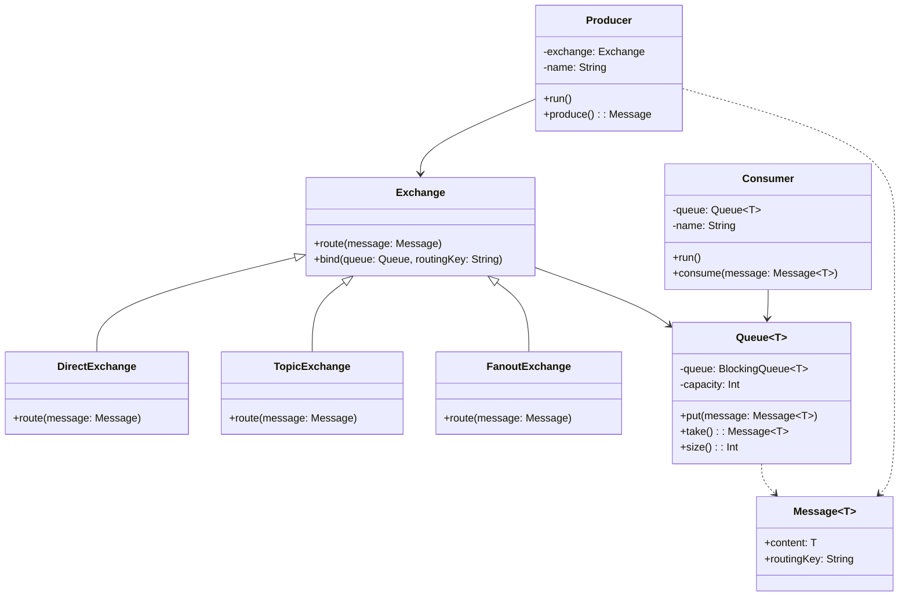

# 生产者消费者模式

生产者消费者模式是一个并发设计模式，它通过将数据的生产和消费解耦，使用共享的缓冲区来协调生产者和消费者之间的工作。这种模式在处理多线程数据流时特别有用。

## 角色介绍

1. **生产者（Producer）**：负责生产数据并将其发送到交换机，可以有多个生产者同时工作
2. **消费者（Consumer）**：从队列中获取数据并进行处理，可以有多个消费者同时工作
3. **交换机（Exchange）**：负责接收生产者的消息，并根据路由规则将消息分发到不同的队列中
   - **直接交换机（Direct Exchange）**：根据精确的路由键将消息发送到队列
   - **主题交换机（Topic Exchange）**：根据通配符匹配的路由键将消息发送到队列
   - **广播交换机（Fanout Exchange）**：将消息广播到所有绑定的队列
4. **队列（Queue）**：一个线程安全的消息存储空间，用于存储交换机分发的消息
5. **数据（Data）**：在生产者和消费者之间传递的实际对象，包含消息内容和路由信息
6. **同步机制（Synchronization）**：确保消息传递过程的线程安全，如阻塞队列、信号量等

## 类图



## 代码实现

```kotlin
import java.util.concurrent.BlockingQueue
import java.util.concurrent.LinkedBlockingQueue
import kotlin.random.Random

// 消息
data class Message<T>(val content: T, val routingKey: String)

// 队列
class Queue<T>(private val capacity: Int) {
    private val queue: BlockingQueue<Message<T>> = LinkedBlockingQueue(capacity)

    fun put(message: Message<T>) {
        queue.put(message)
    }

    fun take(): Message<T> {
        return queue.take()
    }

    fun size(): Int {
        return queue.size
    }
}

// 交换机
interface Exchange {
    fun route(message: Message<*>)
    fun bind(queue: Queue<*>, routingKey: String)
}

// 直接交换机
class DirectExchange : Exchange {
    private val bindings = mutableMapOf<String, Queue<*>>()

    override fun bind(queue: Queue<*>, routingKey: String) {
        bindings[routingKey] = queue
    }

    override fun route(message: Message<*>) {
        bindings[message.routingKey]?.put(message as Message<Any>)
    }
}

// 主题交换机
class TopicExchange : Exchange {
    private val bindings = mutableMapOf<String, Queue<*>>()

    override fun bind(queue: Queue<*>, routingKey: String) {
        bindings[routingKey] = queue
    }

    override fun route(message: Message<*>) {
        bindings.forEach { (pattern, queue) ->
            if (matches(message.routingKey, pattern)) {
                queue.put(message as Message<Any>)
            }
        }
    }

    private fun matches(routingKey: String, pattern: String): Boolean {
        val routingParts = routingKey.split(".")
        val patternParts = pattern.split(".")
        if (routingParts.size != patternParts.size) return false

        return routingParts.zip(patternParts).all { (route, pattern) ->
            pattern == "*" || pattern == route
        }
    }
}

// 广播交换机
class FanoutExchange : Exchange {
    private val queues = mutableListOf<Queue<*>>()

    override fun bind(queue: Queue<*>, routingKey: String) {
        queues.add(queue)
    }

    override fun route(message: Message<*>) {
        queues.forEach { queue ->
            queue.put(message as Message<Any>)
        }
    }
}

// 生产者
class Producer(private val exchange: Exchange, private val name: String) {
    fun run() {
        while (true) {
            try {
                val message = produce()
                exchange.route(message)
                println("$name 生产: ${message.content} (路由键: ${message.routingKey})")
                Thread.sleep(Random.nextLong(1000))
            } catch (e: InterruptedException) {
                break
            }
        }
    }

    private fun produce(): Message<Int> {
        val content = Random.nextInt(100)
        val routingKey = "number.${content % 2}" // 偶数和奇数使用不同的路由键
        return Message(content, routingKey)
    }
}

// 消费者
class Consumer<T>(private val queue: Queue<T>, private val name: String) {
    fun run() {
        while (true) {
            try {
                val message = queue.take()
                consume(message)
                println("$name 消费: ${message.content} (路由键: ${message.routingKey})")
                Thread.sleep(Random.nextLong(1500))
            } catch (e: InterruptedException) {
                break
            }
        }
    }

    private fun consume(message: Message<T>) {
        // 模拟消费过程
    }
}

// 使用示例
fun main() {
    // 创建交换机和队列
    val directExchange = DirectExchange()
    val topicExchange = TopicExchange()
    val fanoutExchange = FanoutExchange()

    val evenQueue = Queue<Int>(5)
    val oddQueue = Queue<Int>(5)
    val allQueue = Queue<Int>(10)

    // 绑定队列到交换机
    directExchange.bind(evenQueue, "number.0") // 偶数队列
    directExchange.bind(oddQueue, "number.1")  // 奇数队列
    fanoutExchange.bind(allQueue, "")         // 所有数字队列

    // 创建生产者和消费者
    val producers = listOf(
        Producer(directExchange, "直接生产者"),
        Producer(fanoutExchange, "广播生产者")
    )

    val consumers = listOf(
        Consumer(evenQueue, "偶数消费者"),
        Consumer(oddQueue, "奇数消费者"),
        Consumer(allQueue, "全部消费者")
    )

    // 启动生产者线程
    val producerThreads = producers.map { producer ->
        Thread {
            producer.run()
        }.apply { start() }
    }

    // 启动消费者线程
    val consumerThreads = consumers.map { consumer ->
        Thread {
            consumer.run()
        }.apply { start() }
    }

    // 运行一段时间后停止
    Thread.sleep(10000)

    // 中断所有线程
    producerThreads.forEach { it.interrupt() }
    consumerThreads.forEach { it.interrupt() }

    // 等待所有线程结束
    producerThreads.forEach { it.join() }
    consumerThreads.forEach { it.join() }
}
```

## 应用场景

1. 多线程数据处理
2. 任务队列系统
3. 日志处理系统
4. 消息队列
5. 数据流处理

## 优点

1. 解耦生产者和消费者
2. 支持并发操作
3. 控制数据流速度
4. 平衡生产和消费速率

## 缺点

1. 需要额外的内存来存储队列
2. 可能出现死锁或饥饿
3. 需要正确处理线程同步
4. 调试复杂度增加

## 实现要点

1. 使用线程安全的队列（如BlockingQueue）
2. 正确处理线程中断
3. 合理设置缓冲区大小
4. 实现优雅的关闭机制
5. 处理异常情况