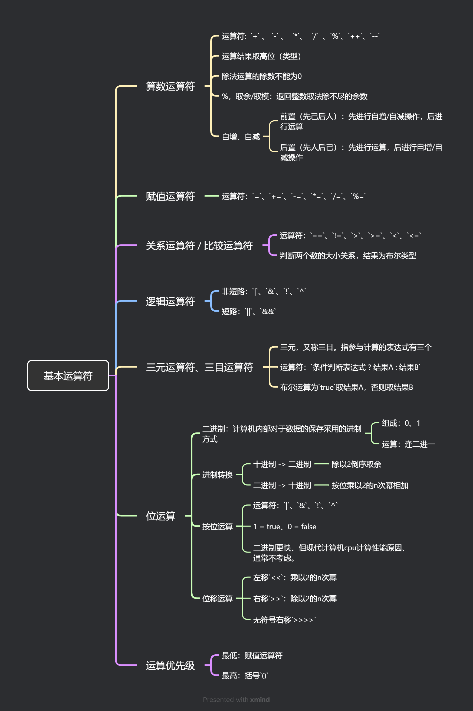

# 运算符



#### 1. 运算符

##### 1.1 算术运算符

- 基本符号：`+` 、 `-` 、  `*`、  `/`  、`%`

- 自增运算和自减运算的前后置问题：
  - 前置`（先己后人）`：先进行`自增/自减`操作，后进行`运算`。
  - 后置`（先人后己）`：先进性`运算`，后进行`自增/自减操作`。
  
  ```java
  /**
   * 算术运算
   */
  public class Demo01 {
  
      public static void main(String[] args) {
  
          // 算术运算的结果取高位
          byte b0 = 10;
          int i0 = 20;
          int i1 = b0 + i0;
  
          System.out.println(10 / 3); // 3
          System.out.println(10.0 / 3); // double
  
          // 除法运算的除数不能为0: java.lang.ArithmeticException: / by zero
  //        System.out.println(10 / 0);
  
          // %，取余/求模，整数除法除不尽的余数
          System.out.println(10 % 3);
          System.out.println(10 % -3);   // 10 = (-3 * -3) + 1
          System.out.println(-10 % 3);   // -10 = (3 * -3) + -1
  
          // ++, --
          int i2 = 10;
          i2++;
          System.out.println(i2);
          int i3 = 10;
          ++i3;
          System.out.println(i3);
          // 参与运算：在前“先己后人”，在后“先人后己”
          int i4 = 10;
          int i5 = ++i4; // 先自增，再运算  ① i4=11 ② i5=11
          System.out.println("i4 = " + i4);
          System.out.println("i5 = " + i5);
  
          int i6 = 10;
          int i7 = i6++; // 先运算 再自增  ① i7=10 ② i6=11
          System.out.println("i6 = " + i6);
          System.out.println("i7 = " + i7);
  
      }
  }
  ```

##### 1.2. 赋值运算符

- 赋值运算符：`=`、`+=`、`-=`、`*=`、`/=`、`%=`

  ```java
  /**
   * 运算符： = ， +=， -=， *=， /=， %=
   */
  public class Demo02 {
  
      public static void main(String[] args) {
  
          int x = 10;
          x += 10; // ① x+10 ② x = x+10
          System.out.println(x);
  
          int y = 10;
          y %= 3;
          System.out.println(y);
  
      }
  }
  
  ```

  

##### 1.3. 比较运算符

- 比较运算符：`==`、`!=`、`>`、`>=`、`<`、`<=`

  ```java
  /**
   * 运算符： ==, !=, >, >=, <, <=
   */
  public class Demo03 {
  
      public static void main(String[] args) {
  
          boolean b = 10 > 20;
          System.out.println(b);
  
          System.out.println(10 == 10);
          System.out.println(10 != 10);
  
      }
  }
  ```

  

##### 1.4. 逻辑运算符

- 逻辑运算符
  - 非短路：`|`、`&`、`!`、`^`
  
  - 短路：`||`、`&&`
  
    ```java
    /**
     * 逻辑运算
     */
    public class Demo04 {
    
        public static void main(String[] args) {
    
            /**
             *  &（shift + 7） 与/单与     两边同时成立，结果true，否则false。并且关系
             *  | (shift + \)  或/单或    两边有一个成立，结果true，否则false。或者关系
             *  ! (shift + 1)  非        取反
             *  ^ (shift + 6)  异或       两边不同，结果为true，否则false。判断两侧是否不同
             */
            System.out.println(10 > 2 & 10 < 10);  //false
            System.out.println(10 > 2 | 10 < 10);  //true
            System.out.println(!(10 > 2));  //false
    
            System.out.println(10 > 2 ^ 10 < 10); // true
    
            /**
             *  &(逻辑与，单与) 和 &&（短路与，双与）运算法则完全一致
             *   - &&: 左边如果得到运算结果，右边不再计算. 开发中经常使用
             *   - &: 左边如果得到运算结果，右边依然计算
             */
    
            int x = 10;
            boolean y1 = x < 2 && ++x > 2;
            boolean y2 = x < 2 & ++x > 2;
            System.out.println(y1);
            System.out.println(y2);
            System.out.println(x);
        }
    }
    
    ```
  
    

##### 1.5. 三元运算符

- 三元运算符：`条件判断表达式 ? 结果A : 结果B`

  ```java
  /**
   * 三元运算/三目运算
   */
  public class Demo05 {
  
      public static void main(String[] args) {
  
          int a = 120;
          int b = 20;
  
          // 求a和b的最大值
          int max = a > b ? a : b;
          System.out.println(max);
  
  
          int x = 12;
          int y = x % 2 == 0 ? x-- : x++;
          System.out.println("x = " + x);
          System.out.println("y = " + y);  // y = 12
  
      }
  }
  
  ```

  

##### 1.6. 位运算符

- 二进制：计算机`内部`对于数据的`保存`使用的进制
  - 使用`0`和`1`组成
  - 逢二进一
  
- 十进制 -> 二进制：除以`2` `倒序` `取余`

- 按位运算：`|`、`&`、`!`、`^`
  - 1 = true、0 = false
  
  - 二进制更快、但现代计算机cpu计算性能原因、通常不考虑。
  
    ```java
    /**
     * ^的应用场景
     */
    public class Demo06 {
    
        public static void main(String[] args) {
    
            // 需求：两个人如果异性，则可以处对象
            // 分析：数据？保存两个人性别 ----> 性别使用什么数据类型保存
            // 开发中，数据如果只有2种值，建议布尔类型. 需要把值定义常量，通过常量的名称表示含义
    
            final boolean GENDER_MAN = true; // 男
            final boolean GENDER_WOMAN = false; // 女
    
            boolean gender1 = GENDER_MAN;
            boolean gender2 = GENDER_WOMAN;
    
            String ok = gender1 ^ gender2 ?  "可以处朋友" : "不可以处朋友";
            System.out.println(ok);
    
    
            // 位运算按位异或，数据异或2次相同的数据，得到最初的结果
            // 数据加密
            int x = 10;
            int y = 10 ^ 3;
            System.out.println(y);  // 9
            int z = y ^ 3;
            System.out.println(z);
    
        }
    }
    ```
  
- 位移运算：
  - 左移`<<`：乘以2的n次幂
  
  - 右移`>>`：除以2的n次幂
  
  - 无符号右移`>>>>`
  
    ```java
    public class Demo07 {
    
        public static void main(String[] args) {
    
            System.out.println(10 << 2); // 40
            System.out.println(10 >> 2); // 2
    
        }
    }
    ```
  
  

##### 2. 运算优先级

- 最低：赋值运算符
- 最高：括号`()`

