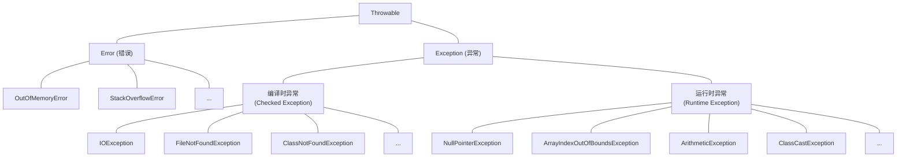

# 异常处理


#### 1. 异常概述

##### 1.1 什么是异常

`异常`是程序在 `编译`或 `运行`过程中发生的 `错误事件`，它会 `中断`程序的 `正常执行流程`。

- **异常处理**：程序发生异常时的处理方式
- **默认处理**：打印异常信息到控制台，终止程序运行

```java
public class ExceptionDemo {
    public static void main(String[] args) {
        // 这会引发异常
        int result = 10 / 0;  // ArithmeticException
        System.out.println("这行代码不会执行");
    }
}
```

##### 1.2 错误分类

根据发生时机，错误可以分为两大类：

###### 1.2.1 编译时错误

`编译时错误`是由于 `程序语法错误`导致的异常，在 `编译阶段`就会被发现。

```java
public class CompileErrorDemo {
    public static void main(String[] args) {
        // 编译时错误示例
        int x = "hello";  // 错误：不兼容的类型，String无法转换为int
      
        // 其他编译时错误
        System.out.println(y);  // 错误：找不到符号y
      
        // 缺少分号
        int z = 10  // 错误：缺少分号
    }
}
```

###### 1.2.2 运行时错误

`运行时错误`是程序在 `运行过程`中发生的异常，如 `空指针`、`数组越界`等。

```java
public class RuntimeErrorDemo {
    public static void main(String[] args) {
        // 空指针异常
        String str = null;
        System.out.println(str.length());  // NullPointerException
      
        // 数组越界异常
        int[] arr = {1, 2, 3};
        System.out.println(arr[5]);  // ArrayIndexOutOfBoundsException
      
        // 算术异常
        int result = 10 / 0;  // ArithmeticException
    }
}
```

#### 2. 异常体系结构

##### 2.1 异常继承体系

Java异常体系以 `Throwable`为根类，分为两大分支：



##### 2.2 Error vs Exception

| 类型                | 特点                     | 处理方式   | 示例             |
| ------------------- | ------------------------ | ---------- | ---------------- |
| **Error**     | 系统级错误，程序无法处理 | 通常不处理 | OutOfMemoryError |
| **Exception** | 程序级异常，可以处理     | 应该处理   | IOException      |

##### 2.3 编译时异常 vs 运行时异常

###### 2.3.1 编译时异常（Checked Exception）

- **特点**：编译前必须处理，否则编译不通过
- **作用**：起到错误提示的作用，强制程序员处理可能的异常
- **处理**：必须使用try-catch或throws处理

```java
import java.io.*;

public class CheckedExceptionDemo {
    public static void main(String[] args) {
        // 必须处理FileNotFoundException
        try {
            FileReader file = new FileReader("test.txt");
            BufferedReader reader = new BufferedReader(file);
            String line = reader.readLine();
            System.out.println(line);
            reader.close();
        } catch (IOException e) {
            System.out.println("文件操作异常：" + e.getMessage());
        }
    }
}
```

**常见编译时异常**：

- `FileNotFoundException`：文件未找到异常
- `IOException`：输入输出异常
- `ClassNotFoundException`：类未找到异常
- `SQLException`：数据库操作异常

###### 2.3.2 运行时异常（Runtime Exception）

- **特点**：编译可以通过，在运行时发生错误
- **本质**：通常是程序bug，需要修复代码逻辑
- **处理**：可以处理，也可以不处理

```java
public class RuntimeExceptionDemo {
    public static void main(String[] args) {
        // 1. 空指针异常
        demonstrateNullPointer();
      
        // 2. 数组越界异常
        demonstrateArrayIndexOutOfBounds();
      
        // 3. 算术异常
        demonstrateArithmetic();
      
        // 4. 类型转换异常
        demonstrateClassCast();
      
        // 5. 字符串索引越界异常
        demonstrateStringIndexOutOfBounds();
    }
  
    // 空指针异常示例
    public static void demonstrateNullPointer() {
        try {
            String str = null;
            System.out.println("字符串长度：" + str.length());
        } catch (NullPointerException e) {
            System.out.println("空指针异常：" + e.getMessage());
        }
    }
  
    // 数组越界异常示例
    public static void demonstrateArrayIndexOutOfBounds() {
        try {
            int[] arr = {1, 2, 3};
            System.out.println("数组元素：" + arr[5]);
        } catch (ArrayIndexOutOfBoundsException e) {
            System.out.println("数组越界异常：" + e.getMessage());
        }
    }
  
    // 算术异常示例
    public static void demonstrateArithmetic() {
        try {
            int result = 10 / 0;
            System.out.println("计算结果：" + result);
        } catch (ArithmeticException e) {
            System.out.println("算术异常：" + e.getMessage());
        }
    }
  
    // 类型转换异常示例
    public static void demonstrateClassCast() {
        try {
            Object obj = "Hello";
            Integer num = (Integer) obj;  // 错误的类型转换
            System.out.println("转换结果：" + num);
        } catch (ClassCastException e) {
            System.out.println("类型转换异常：" + e.getMessage());
        }
    }
  
    // 字符串索引越界异常示例
    public static void demonstrateStringIndexOutOfBounds() {
        try {
            String str = "Hello";
            char ch = str.charAt(10);
            System.out.println("字符：" + ch);
        } catch (StringIndexOutOfBoundsException e) {
            System.out.println("字符串索引越界异常：" + e.getMessage());
        }
    }
}
```

#### 3. 异常处理机制

##### 3.1 异常处理流程

1. **抛出异常**：程序遇到异常情况时，创建异常对象并抛出
2. **捕获异常**：JVM或程序捕获异常对象
3. **处理异常**：根据是否有处理方案决定如何处理

```java
public class ExceptionFlowDemo {
    public static void main(String[] args) {
        System.out.println("程序开始");
      
        try {
            int result = divide(10, 0);  // 这里会抛出异常
            System.out.println("结果：" + result);  // 这行不会执行
        } catch (ArithmeticException e) {
            System.out.println("捕获到异常：" + e.getMessage());
        }
      
        System.out.println("程序继续执行");
    }
  
    public static int divide(int a, int b) {
        return a / b;  // 当b为0时，这里会抛出ArithmeticException
    }
}
```

##### 3.2 throw关键字

`throw`用于 `手动抛出异常`，实例化异常对象并抛给JVM处理。

```java
public class ThrowDemo {
    public static void main(String[] args) {
        try {
            checkAge(15);
        } catch (IllegalArgumentException e) {
            System.out.println("异常信息：" + e.getMessage());
        }
    }
  
    public static void checkAge(int age) {
        if (age < 18) {
            // 手动抛出异常
            throw new IllegalArgumentException("年龄不能小于18岁，当前年龄：" + age);
        }
        System.out.println("年龄验证通过：" + age);
    }
}
```

#### 4. 异常处理方式

##### 4.1 try-catch-finally

###### 4.1.1 基本语法

```java
try {
    // 可能出现异常的代码
} catch (ExceptionType1 e1) {
    // 处理ExceptionType1类型的异常
} catch (ExceptionType2 e2) {
    // 处理ExceptionType2类型的异常
} finally {
    // 无论是否发生异常都会执行的代码
}
```

###### 4.1.2 详细示例

```java
import java.io.*;

public class TryCatchFinallyDemo {
    public static void main(String[] args) {
        // 1. 基本try-catch
        basicTryCatch();
      
        // 2. 多个catch
        multipleCatch();
      
        // 3. try-catch-finally
        tryCatchFinally();
      
        // 4. 多异常同时处理
        multipleExceptionInOneCatch();
    }
  
    // 基本try-catch示例
    public static void basicTryCatch() {
        System.out.println("=== 基本try-catch ===");
        try {
            int result = 10 / 0;
            System.out.println("结果：" + result);
        } catch (ArithmeticException e) {
            System.out.println("捕获算术异常：" + e.getMessage());
        }
    }
  
    // 多个catch示例
    public static void multipleCatch() {
        System.out.println("\n=== 多个catch ===");
        try {
            String str = null;
            int[] arr = {1, 2, 3};
          
            // 可能抛出多种异常
            System.out.println(str.length());  // NullPointerException
            System.out.println(arr[5]);        // ArrayIndexOutOfBoundsException
          
        } catch (NullPointerException e) {
            System.out.println("空指针异常：" + e.getMessage());
        } catch (ArrayIndexOutOfBoundsException e) {
            System.out.println("数组越界异常：" + e.getMessage());
        } catch (Exception e) {
            // 捕获其他所有异常（范围最大的放在最后）
            System.out.println("其他异常：" + e.getMessage());
        }
    }
  
    // try-catch-finally示例
    public static void tryCatchFinally() {
        System.out.println("\n=== try-catch-finally ===");
        FileReader reader = null;
        try {
            reader = new FileReader("test.txt");
            System.out.println("文件打开成功");
        } catch (FileNotFoundException e) {
            System.out.println("文件未找到：" + e.getMessage());
        } finally {
            // 无论是否发生异常都会执行
            System.out.println("finally块执行");
            if (reader != null) {
                try {
                    reader.close();
                    System.out.println("文件已关闭");
                } catch (IOException e) {
                    System.out.println("关闭文件时发生异常：" + e.getMessage());
                }
            }
        }
    }
  
    // 多异常同时处理
    public static void multipleExceptionInOneCatch() {
        System.out.println("\n=== 多异常同时处理 ===");
        try {
            // 模拟可能抛出多种异常的代码
            String str = args.length > 0 ? args[0] : null;
            int length = str.length();
            int result = 10 / length;
            System.out.println("结果：" + result);
        } catch (NullPointerException | ArithmeticException e) {
            // Java 7+支持同时捕获多种异常
            System.out.println("捕获到异常：" + e.getClass().getSimpleName() + " - " + e.getMessage());
        }
    }
}
```

###### 4.1.3 注意事项

- **try内部代码**：会逐行扫描，效率相对较低
- **catch顺序**：子类异常在前，父类异常在后
- **finally执行**：无论是否发生异常都会执行
- **资源释放**：通常在finally中释放资源

##### 4.2 throws声明

`throws`用于 `方法声明`中，表示该方法可能抛出指定类型的异常。

```java
import java.io.*;

public class ThrowsDemo {
    public static void main(String[] args) {
        try {
            // 调用可能抛出异常的方法
            readFile("test.txt");
        } catch (IOException e) {
            System.out.println("处理IO异常：" + e.getMessage());
        }
    }
  
    // 使用throws声明可能抛出的异常
    public static void readFile(String fileName) throws IOException {
        FileReader reader = new FileReader(fileName);
        BufferedReader bufferedReader = new BufferedReader(reader);
      
        String line = bufferedReader.readLine();
        System.out.println("文件内容：" + line);
      
        bufferedReader.close();
    }
  
    // 方法可以同时抛出多个异常
    public static void processFile(String fileName) 
            throws FileNotFoundException, IOException, SecurityException {
        // 方法实现
    }
  
    // 抛出运行时异常（可选）
    public static void validateInput(String input) throws IllegalArgumentException {
        if (input == null || input.trim().isEmpty()) {
            throw new IllegalArgumentException("输入不能为空");
        }
    }
}
```

##### 4.3 try-with-resources（推荐）

Java 7引入的 `try-with-resources`语法，自动管理资源。

```java
import java.io.*;

public class TryWithResourcesDemo {
    public static void main(String[] args) {
        // 传统方式
        traditionalWay();
      
        // try-with-resources方式
        tryWithResourcesWay();
    }
  
    // 传统方式（繁琐）
    public static void traditionalWay() {
        FileReader reader = null;
        BufferedReader bufferedReader = null;
        try {
            reader = new FileReader("test.txt");
            bufferedReader = new BufferedReader(reader);
            String line = bufferedReader.readLine();
            System.out.println(line);
        } catch (IOException e) {
            System.out.println("IO异常：" + e.getMessage());
        } finally {
            try {
                if (bufferedReader != null) {
                    bufferedReader.close();
                }
                if (reader != null) {
                    reader.close();
                }
            } catch (IOException e) {
                System.out.println("关闭资源异常：" + e.getMessage());
            }
        }
    }
  
    // try-with-resources方式（推荐）
    public static void tryWithResourcesWay() {
        // 资源会自动关闭
        try (FileReader reader = new FileReader("test.txt");
             BufferedReader bufferedReader = new BufferedReader(reader)) {
          
            String line = bufferedReader.readLine();
            System.out.println(line);
          
        } catch (IOException e) {
            System.out.println("IO异常：" + e.getMessage());
        }
        // 不需要手动关闭资源
    }
}
```

#### 5. 异常常用方法

```java
public class ExceptionMethodsDemo {
    public static void main(String[] args) {
        try {
            int result = 10 / 0;
        } catch (ArithmeticException e) {
            // 1. printStackTrace() - 打印异常堆栈信息
            System.out.println("=== printStackTrace() ===");
            e.printStackTrace();
          
            // 2. getMessage() - 获取异常信息
            System.out.println("\n=== getMessage() ===");
            String message = e.getMessage();
            System.out.println("异常信息：" + message);
          
            // 3. toString() - 获取异常的字符串表示
            System.out.println("\n=== toString() ===");
            String exceptionStr = e.toString();
            System.out.println("异常字符串：" + exceptionStr);
          
            // 4. getClass() - 获取异常类型
            System.out.println("\n=== getClass() ===");
            Class<?> exceptionClass = e.getClass();
            System.out.println("异常类型：" + exceptionClass.getName());
          
            // 5. getStackTrace() - 获取堆栈跟踪元素数组
            System.out.println("\n=== getStackTrace() ===");
            StackTraceElement[] stackTrace = e.getStackTrace();
            for (StackTraceElement element : stackTrace) {
                System.out.println("  at " + element);
            }
        }
    }
}
```

#### 6. 自定义异常

##### 6.1 使用场景

自定义异常通常用于 `业务逻辑层面`的问题，代码运行层面没问题，但逻辑层面有问题。

##### 6.2 创建自定义异常

```java
// 自定义编译时异常
class AgeException extends Exception {
    public AgeException() {
        super();
    }
  
    public AgeException(String message) {
        super(message);
    }
  
    public AgeException(String message, Throwable cause) {
        super(message, cause);
    }
}

// 自定义运行时异常
class BalanceInsufficientException extends RuntimeException {
    private double currentBalance;
    private double requiredAmount;
  
    public BalanceInsufficientException(double currentBalance, double requiredAmount) {
        super(String.format("余额不足：当前余额%.2f，需要%.2f", currentBalance, requiredAmount));
        this.currentBalance = currentBalance;
        this.requiredAmount = requiredAmount;
    }
  
    public double getCurrentBalance() {
        return currentBalance;
    }
  
    public double getRequiredAmount() {
        return requiredAmount;
    }
}

public class CustomExceptionDemo {
    public static void main(String[] args) {
        // 测试自定义编译时异常
        try {
            validateAge(15);
        } catch (AgeException e) {
            System.out.println("年龄验证失败：" + e.getMessage());
        }
      
        // 测试自定义运行时异常
        try {
            withdraw(1000.0, 1500.0);
        } catch (BalanceInsufficientException e) {
            System.out.println("取款失败：" + e.getMessage());
            System.out.println("当前余额：" + e.getCurrentBalance());
            System.out.println("需要金额：" + e.getRequiredAmount());
        }
    }
  
    // 使用自定义编译时异常
    public static void validateAge(int age) throws AgeException {
        if (age < 18) {
            throw new AgeException("年龄必须大于等于18岁，当前年龄：" + age);
        }
        System.out.println("年龄验证通过：" + age);
    }
  
    // 使用自定义运行时异常
    public static void withdraw(double balance, double amount) {
        if (amount > balance) {
            throw new BalanceInsufficientException(balance, amount);
        }
        System.out.println("取款成功，余额：" + (balance - amount));
    }
}
```

##### 6.3 最佳实践

```java
// 业务异常基类
abstract class BusinessException extends Exception {
    private String errorCode;
  
    public BusinessException(String errorCode, String message) {
        super(message);
        this.errorCode = errorCode;
    }
  
    public String getErrorCode() {
        return errorCode;
    }
}

// 具体业务异常
class UserNotFoundException extends BusinessException {
    public UserNotFoundException(String userId) {
        super("USER_NOT_FOUND", "用户不存在：" + userId);
    }
}

class InvalidPasswordException extends BusinessException {
    public InvalidPasswordException() {
        super("INVALID_PASSWORD", "密码错误");
    }
}

// 用户服务类
class UserService {
    public void login(String username, String password) 
            throws UserNotFoundException, InvalidPasswordException {
        // 模拟用户验证逻辑
        if (!"admin".equals(username)) {
            throw new UserNotFoundException(username);
        }
        if (!"123456".equals(password)) {
            throw new InvalidPasswordException();
        }
        System.out.println("登录成功：" + username);
    }
}
```

#### 7. 第三方异常处理

##### 7.1 日志框架

使用专业的日志框架记录异常信息：

```java
// 使用SLF4J + Logback
import org.slf4j.Logger;
import org.slf4j.LoggerFactory;

public class LoggingExceptionDemo {
    private static final Logger logger = LoggerFactory.getLogger(LoggingExceptionDemo.class);
  
    public static void main(String[] args) {
        try {
            riskyOperation();
        } catch (Exception e) {
            // 记录异常日志
            logger.error("操作失败", e);
        }
    }
  
    public static void riskyOperation() throws Exception {
        throw new RuntimeException("模拟异常");
    }
}
```

##### 7.2 Lombok简化异常处理

```java
// 使用Lombok的@SneakyThrows注解
import lombok.SneakyThrows;

public class LombokExceptionDemo {
  
    @SneakyThrows
    public static void readFile(String fileName) {
        // 不需要显式处理IOException
        FileReader reader = new FileReader(fileName);
        // ...
    }
}
```

#### 8. Lambda和函数式编程中的异常处理

##### 8.1 问题背景

在Java 8+的函数式编程中，Lambda表达式和Stream API经常遇到检查型异常处理的困境。标准的函数式接口（如 `Runnable`、`Function`、`Consumer`等）不允许抛出检查型异常。

```java
// 问题示例：无法在Lambda中直接处理检查型异常
ExecutorService executor = Executors.newSingleThreadExecutor();

executor.submit(() -> {
    processFile(); // ❌ 编译错误：未处理的IOException
});

public void processFile() throws IOException {
    // 文件处理逻辑
}
```

##### 8.2 解决方案：异常透明处理

通过泛型协变和自定义函数式接口，可以优雅地处理这个问题：

```java
// 1. 定义支持异常的函数式接口
@FunctionalInterface
public interface ThrowingRunnable<E extends Exception> {
    void run() throws E;
}

@FunctionalInterface
public interface ThrowingFunction<T, R, E extends Exception> {
    R apply(T t) throws E;
}

// 2. 异常转换工具类
public class ExceptionUtils {
    public static <E extends Exception> Runnable unchecked(ThrowingRunnable<E> runnable) {
        return () -> {
            try {
                runnable.run();
            } catch (Exception e) {
                throwAsUnchecked(e);
            }
        };
    }
  
    public static <T, R, E extends Exception> Function<T, R> unchecked(
            ThrowingFunction<T, R, E> function) {
        return t -> {
            try {
                return function.apply(t);
            } catch (Exception e) {
                throwAsUnchecked(e);
                return null; // 永远不会执行
            }
        };
    }
  
    @SuppressWarnings("unchecked")
    private static <E extends Throwable> void throwAsUnchecked(Throwable e) throws E {
        throw (E) e; // 利用类型擦除"欺骗"编译器
    }
}
```

##### 8.3 使用示例

```java
public class LambdaExceptionDemo {
    public static void main(String[] args) {
        // 1. 在线程池中使用
        ExecutorService executor = Executors.newSingleThreadExecutor();
      
        Future<?> future = executor.submit(ExceptionUtils.unchecked(() -> {
            processFile(); // 现在可以直接调用了
        }));
      
        try {
            future.get();
        } catch (ExecutionException e) {
            Throwable cause = e.getCause();
            if (cause instanceof IOException) {
                System.err.println("文件处理失败: " + cause.getMessage());
            }
        }
      
        // 2. 在Stream API中使用
        List<String> files = Arrays.asList("file1.txt", "file2.txt");
      
        List<String> contents = files.stream()
            .map(ExceptionUtils.unchecked(fileName -> {
                return Files.readString(Paths.get(fileName)); // 可能抛出IOException
            }))
            .collect(Collectors.toList());
    }
  
    public static void processFile() throws IOException {
        // 文件处理逻辑
    }
}
```

##### 8.4 核心原理

1. **类型擦除**：运行时泛型信息被擦除，`E`实际上是 `Throwable`
2. **编译器欺骗**：通过泛型强制转换绕过编译器的检查型异常检查
3. **异常透明**：原始异常被保留并重新抛出，不会丢失异常信息
4. **延迟处理**：异常在合适的边界（如 `Future.get()`）被重新包装和处理

##### 8.5 应用场景

- **并发编程**：向 `ExecutorService`提交任务
- **Stream API**：在 `map`、`filter`等操作中处理IO或网络异常
- **函数式编程**：任何需要传入函数式接口但内部有检查型异常的场景

##### 8.6 注意事项

- 这种方法不会真正"消除"异常，只是改变了异常的传播方式
- 需要在合适的地方捕获和处理异常
- 适用于异常需要向上传播的场景，不适用于需要就地处理的情况

#### 9. 调试（Debug）

##### 9.1 Debug概念

- **Bug**：程序中的错误或问题
- **Debug**：调试，查找和修复bug的过程
- **断点（Breakpoint）**：程序暂停执行的位置

##### 9.2 IDEA调试操作

```java
public class DebugDemo {
    public static void main(String[] args) {
        int a = 10;
        int b = 0;
      
        // 在这里设置断点
        int result = divide(a, b);
        System.out.println("结果：" + result);
    }
  
    public static int divide(int x, int y) {
        // 在这里也可以设置断点
        return x / y;
    }
}
```

**调试快捷键**：

- **F8 (Step Over)**：执行下一行代码
- **F7 (Step Into)**：进入方法内部
- **Shift + F8 (Step Out)**：跳出当前方法
- **F9 (Resume Program)**：继续运行到下一个断点

##### 9.3 调试技巧

```java
public class DebugTipsDemo {
    public static void main(String[] args) {
        int[] numbers = {1, 2, 3, 4, 5};
      
        // 1. 条件断点：只有当i==3时才暂停
        for (int i = 0; i < numbers.length; i++) {
            int value = numbers[i] * 2;  // 在此行设置条件断点：i == 3
            System.out.println("索引" + i + "，值：" + value);
        }
      
        // 2. 异常断点：当发生特定异常时自动暂停
        try {
            String str = null;
            str.length();  // 会触发NullPointerException断点
        } catch (Exception e) {
            System.out.println("捕获异常：" + e.getMessage());
        }
    }
}
```

#### 10. 单元测试（JUnit）

##### 10.1 JUnit概述

`JUnit`是Java中最流行的 `单元测试框架`，用于测试代码的正确性。

- **主流版本**：JUnit 4、JUnit 5
- **作用**：自动化测试、回归测试、测试驱动开发

##### 10.2 JUnit 5常用注解

```java
import org.junit.jupiter.api.*;
import static org.junit.jupiter.api.Assertions.*;

public class JUnitDemo {
  
    @BeforeAll
    static void setUpBeforeClass() {
        // 所有测试方法执行前只执行一次
        System.out.println("测试类初始化");
    }
  
    @AfterAll
    static void tearDownAfterClass() {
        // 所有测试方法执行后只执行一次
        System.out.println("测试类清理");
    }
  
    @BeforeEach
    void setUp() {
        // 每个测试方法执行前都会执行
        System.out.println("测试方法准备");
    }
  
    @AfterEach
    void tearDown() {
        // 每个测试方法执行后都会执行
        System.out.println("测试方法清理");
    }
  
    @Test
    void testAddition() {
        // 测试加法运算
        int result = 2 + 3;
        assertEquals(5, result, "2 + 3 应该等于 5");
    }
  
    @Test
    void testDivision() {
        // 测试除法运算
        assertThrows(ArithmeticException.class, () -> {
            int result = 10 / 0;
        }, "除零应该抛出ArithmeticException");
    }
  
    @Test
    @DisplayName("测试字符串操作")
    void testStringOperations() {
        String str = "Hello World";
      
        assertNotNull(str, "字符串不应为null");
        assertEquals(11, str.length(), "字符串长度应为11");
        assertTrue(str.contains("World"), "字符串应包含'World'");
        assertFalse(str.isEmpty(), "字符串不应为空");
    }
  
    @Test
    @Disabled("暂时禁用此测试")
    void testDisabled() {
        // 这个测试不会执行
        fail("这个测试被禁用了");
    }
}
```

##### 10.3 异常测试

```java
import org.junit.jupiter.api.Test;
import static org.junit.jupiter.api.Assertions.*;

public class ExceptionTestDemo {
  
    @Test
    void testExpectedException() {
        // 测试期望的异常
        Exception exception = assertThrows(IllegalArgumentException.class, () -> {
            validateAge(-5);
        });
      
        assertEquals("年龄不能为负数", exception.getMessage());
    }
  
    @Test
    void testNoException() {
        // 测试不应该抛出异常
        assertDoesNotThrow(() -> {
            validateAge(25);
        });
    }
  
    private void validateAge(int age) {
        if (age < 0) {
            throw new IllegalArgumentException("年龄不能为负数");
        }
    }
}
```

#### 11. 异常处理最佳实践

##### 11.1 异常处理原则

1. **及早抛出，延迟捕获**：在发现问题时立即抛出异常，在合适的地方捕获处理
2. **具体化异常**：使用具体的异常类型，而不是通用的Exception
3. **保留异常信息**：记录足够的上下文信息帮助调试
4. **资源清理**：确保在异常情况下也能正确释放资源
5. **不要忽略异常**：至少要记录异常信息

##### 11.2 异常处理反模式

```java
public class ExceptionAntiPatterns {
  
    // ❌ 错误：吞掉异常
    public void badExample1() {
        try {
            riskyOperation();
        } catch (Exception e) {
            // 什么都不做，异常被吞掉了
        }
    }
  
    // ❌ 错误：过于宽泛的异常捕获
    public void badExample2() {
        try {
            riskyOperation();
        } catch (Exception e) {  // 捕获所有异常
            System.out.println("出错了");  // 信息不够具体
        }
    }
  
    // ❌ 错误：在循环中处理异常
    public void badExample3() {
        for (int i = 0; i < 1000; i++) {
            try {
                processItem(i);
            } catch (Exception e) {
                // 每次循环都可能处理异常，性能差
            }
        }
    }
  
    // ✅ 正确：具体的异常处理
    public void goodExample() {
        try {
            riskyOperation();
        } catch (FileNotFoundException e) {
            logger.error("文件未找到：{}", e.getMessage(), e);
            // 具体的处理逻辑
        } catch (IOException e) {
            logger.error("IO操作失败：{}", e.getMessage(), e);
            // 具体的处理逻辑
        }
    }
  
    private void riskyOperation() throws IOException {
        // 模拟可能抛出异常的操作
    }
  
    private void processItem(int item) throws Exception {
        // 模拟处理项目
    }
}
```

##### 11.3 异常处理模板

```java
import java.util.logging.Logger;

public class ExceptionHandlingTemplate {
    private static final Logger logger = Logger.getLogger(ExceptionHandlingTemplate.class.getName());
  
    public Result processRequest(Request request) {
        // 1. 参数验证
        if (request == null) {
            throw new IllegalArgumentException("请求不能为null");
        }
      
        try {
            // 2. 核心业务逻辑
            return doProcess(request);
          
        } catch (BusinessException e) {
            // 3. 业务异常处理
            logger.warning("业务处理失败：" + e.getMessage());
            return Result.failure(e.getErrorCode(), e.getMessage());
          
        } catch (Exception e) {
            // 4. 系统异常处理
            logger.severe("系统异常：" + e.getMessage());
            return Result.failure("SYSTEM_ERROR", "系统繁忙，请稍后重试");
        }
    }
  
    private Result doProcess(Request request) throws BusinessException {
        // 具体的业务处理逻辑
        return Result.success("处理成功");
    }
  
    // 请求类
    static class Request {
        // 请求参数
    }
  
    // 结果类
    static class Result {
        private boolean success;
        private String code;
        private String message;
      
        public static Result success(String message) {
            Result result = new Result();
            result.success = true;
            result.message = message;
            return result;
        }
      
        public static Result failure(String code, String message) {
            Result result = new Result();
            result.success = false;
            result.code = code;
            result.message = message;
            return result;
        }
    }
  
    // 业务异常
    static class BusinessException extends Exception {
        private String errorCode;
      
        public BusinessException(String errorCode, String message) {
            super(message);
            this.errorCode = errorCode;
        }
      
        public String getErrorCode() {
            return errorCode;
        }
    }
}
```

> **总结**：
>
> - 异常是程序错误处理的重要机制
> - 合理使用try-catch-finally和throws
> - 创建有意义的自定义异常
> - 使用调试工具定位问题
> - 编写单元测试验证异常处理
> - 遵循异常处理最佳实践
