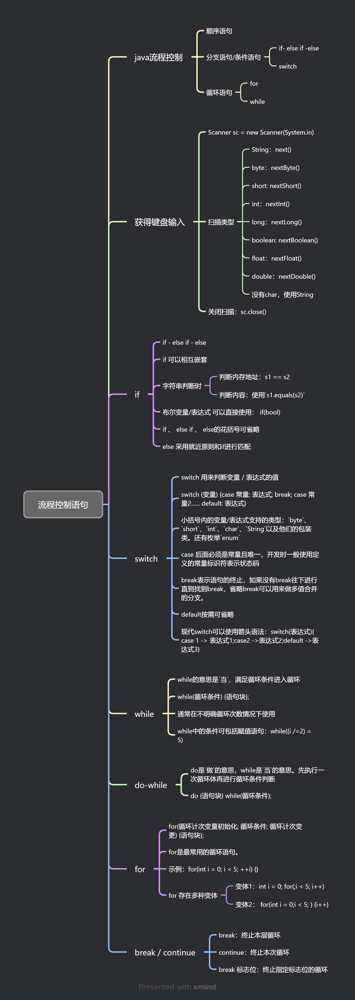

# 流程控制语句



##### Java流程控制

- 顺序型：程序从开始运行到结束
- 条件/分支型：程序根据条件选择分支进行
- 循环型：满足某个条件一直执行，直到不满足为止（可能出现死循环）

##### if （if - else if - else）

- `if - else if - else`

  - 如果条件为`真`，执行`if`后面内容
  - 如果条件为`假`，先判断`if else `是否为真
    - 如果条件为`真`，返回`if else `后面内容
    - 如果条件为`假`，返回`else`后面内容

- `if 嵌套`

  - 流程控制语句中，可以嵌套使用
  - 能不使用嵌套尽量不使用，可用逻辑表达式替代
  
  ```java
  // 如果双方均满18岁，并且异性的，可以交朋友
  // 能不嵌套尽量不嵌套
  if (age1 >= 18 && age2 >= 18 && gender1 ^ gender2) {
      System.out.println("他们可以交朋友");
  } else {
      System.out.println("他们不可以交朋友");
  }
  ```
  
  

> **Scanner扫描终端IO输入内容**
>
> - 通过`Ctrl` + `Enter`使用`Idea`的`智能填充`，并可完成`自动导包`
>
> - 可使用`Scanner`类对`终端输入`进行扫描
>
>   ```java
>   // 注册扫描器
>   Scanner sc = new Scanner(System.in);
>               
>   // 终端打印，以提醒用户将要输入的内容
>   System.out.println("请输入一个数字");
>               
>   // 扫描输入内容，并把输入结果赋值给变量a
>   Int a = sc.nextInt();
>               
>   // 关闭扫描器
>   sc.close();
>   ```

- 字符串判断方法：
  - 使用`s1 == s2`判断内存地址是否相等
  - 使用 `s1.equals(s2)`判断字符串内容是否相等
  
  ```java
  // char的判断
  char c1 = 'a';
  char c2 = 'b';
  if (c1 == c2) {
      System.out.println("c1 == c2");
  } else {
      System.out.println("c1 != c2");
  }
  // String的判断
  String s1 = "a";
  String s2 = "b";
  System.out.println(s1 == s2)
  System.out.println(s1.equals(s2))
  ```

##### switch

- switch 用来判断变量 / 表达式的值

- switch一般写法

  ```java
  switch(变量/表达式) {
      case 常量A:
          表达式语句;
      break;
      case 常量B:
          表达式语句;
      break;
      default:
          表达式语句;
      break;
  }
  ```

- 小括号内的变量/表达式支持的类型：`byte`、`short`、`int`、`char`、`String`以及他们的包装类。还有枚举`enum`

- case 后面必须是常量且唯一，开发时一般使用定义的常量标识符表示状态码

  ```java
  // 需求： 请输入数字，数字范围0=游戏开始，1=游戏暂停，2=游戏继续，3=游戏结束，以上都不对=输入错误
  System.out.println("请输入操作：0=游戏开始，1=游戏暂停，2=游戏继续，3=游戏结束");
  Scanner sc = new Scanner(System.in);
  int state = sc.nextInt();
  sc.close();
  
  // 状态码
  final int STATE_START = 0;
  final int STATE_PAUSE = 1;
  switch (state) {
      case STATE_START:
           System.out.println("游戏开始....");
      break;
      case STATE_PAUSE:
           System.out.println("游戏暂停....");
      break;
      case 2:
           System.out.println("游戏继续....");
      break;
      case 3:
           System.out.println("游戏结束....");
      break;
      default:
           System.out.println("输入错误");
  }
  ```

  

- break表示语句的终止，如果没有break往下进行直到找到break，省略break可以用来做多值合并的分支。

  ```java
  Scanner sc = new Scanner(System.in);
  String str = sc.next();
  sc.close();
  
  switch (str) {
      case "a":
      case "b":
          System.out.println("1111");
          break;
      case "c":
      case "d":
          System.out.println("2222");
          break;
  }
  ```

- default按需可省略

- 现代switch写法：

  ```java
  switch(变量/表达式) {
      case 常量A ->
          表达式语句;
      case 常量B ->
          表达式语句;
      default:
          表达式语句;
  }
  ```


##### while

- `while`的意思是`当`，满足`循环条件`进入循环

  ```JAVA
  while(循环条件) {语句块};
  ```

- `while`通常在不明确循环次数情况下使用

- `while`中的条件可包括赋值语句：`while((len /=2) = 5)`

  ```java
  while((len /= 2) >= 5) {
      count++;
  }
  ```

  

##### do-while

- do是`做`的意思，while是`当`的意思。`先执行一次`循环体再进行`循环条件`判断

  ```java
  do {语句块} while(循环条件);
  ```

##### for

- for是最常用的循环语句。

  ```java
  // for(循环计次变量初始化; 循环条件; 循环计次变更) {语句块}
  for(int i = 0; i < 5; ++i) {
      System.out.println("i = " + i);
  }
  
  // 变体1. 循环计次变量初始化可以放在for语句前面
  int i = 0;
  for(;i < 5 ; ++i) {
      System.out.println("i = " + i);
  }
  
  // 变体2. 循环计次变更可放在循环体里面
  for(int i = 0;i < 5;) {
      System.out.println("i = " + i);
      i++;
  }
  ```

##### break、continue

- break：终止本层循环
- continue：终止本次循环
- break 标志位：终止指定标志位的循环

```java
for (int i = 0; i < 10; i++) {
    if (i == 5) {
        // 终止本层循环
        break;
    }
    System.out.println(i);
}

int i = 0;
while (i < 10) {
    if (i == 5) {
        break; // 当i等于5时退出循环
    }
    System.out.println(i);
    i++;
}
// 输出：0 1 2 3 4

for (int i = 0; i < 10; i++) {
    if (i == 5) {
        // 终止本次循环，回到条件变更位置继续循环
        continue;
    }
    System.out.println(i);
}

int i = 0;
while (i < 5) {
    i++;
    if (i == 3) {
        continue; // 跳过i=3时的剩余循环体
    }
    System.out.println(i);
}
// 输出：1 2 4 5

// break 终止标志位
break1:
    for (int i = 0; i < 10; i++) {
        break2:
            for (int j = 0; j < 10; j++) {
                if (j == 5) {
                    break break1;
                }
                System.out.print(i + " - " + j + "\t");
            }
            System.out.println();
    }
```

