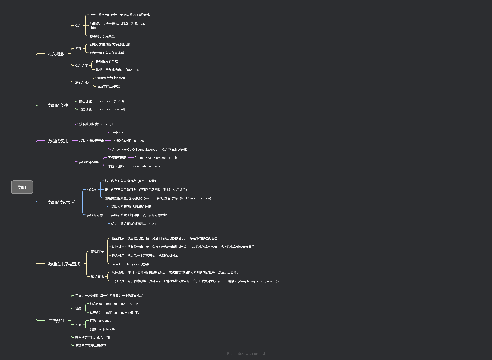

# 数组



#### 1. 数组的概念

##### 1.1 数组

- java的`数组`用来存放`一组相同`的`数据类型`
- 数组使用`大括号`表示。例如`{1, 3, 5}`、`{"aaa", "bbb", "ccc"}`
- 数组属于`引用类型`

##### 1.2 元素

- `数组存放的数据`称为`元素`
- `数组的元素`可以为`任意类型`
- 数组的基本属性：`length`

#### 2. 数组的创建

`java`中数组的创建之后`长度不变`。

- 静态创建

  ```java
  int[] arr = {1, 2, 3}
  ```

- 动态创建

  ```java
  int[] arr = new int[3];
  ```

  

#### 3.数组的基本使用

##### 3.1 数组的长度

数组的长度使用length属性

```java
int[] arr = {1, 2, 3};
arr.length // -> 3
```

##### 3.2 数组元素的下标法获取与修改

- 可以使用`arr[index]`的方式获取数组指定下标的元素

  ```java
  arr[1]  // -> 2
  ```

- `arr[index]`可以作为`左值`出现，作用是修改指定下标元素

  ```java
  arr[0] = 800
  arr // -> {800, 2, 3}
  ```

- 数组下标的取值范围是：`0`~ `arr.length - 1`

- 当不符合数组下标取值范围时，出现`数组元素下标异常(ArrayIndexOutOfBoundsException)`

  ```java
  /* Exception in thread "main" java.lang.ArrayIndexOutOfBoundsException: Index 100 out of bounds for length 4
   at Demo01.main(Demo01.java:16) */
  arr[100] = 100;
  ```
##### 3.3 数组循环/遍历

- 下标循环遍历

  ```java
  int sum = 0;
  for (int i = 0; i < arr.length; i++) {
      sum += arr[i];
  }
  ```

- 增强for循环

  ```java
  int sum = 0;
  for (int element: arr) {
      sum += element;
  }
  ```

#### 4. 数组的数据结构

##### 4.1 堆和栈

- 栈：内存可以`自动回收`（例如：`变量`）

- 堆：内存不会`自动回收`，但可以`手动回收`（例如：`引用类型`）

- 引用类型的变量没有实例化`（null）`，会报`空指针异常（NullPointerException）`

  ```java
  String[] arr_str = null;
  arr_str[1] // java.lang.NullPointerExceptio
  ```

##### 4.2 数组的内存

- 数组元素的`内存地址`是`连续的`
- 数组初始`默认`指向`第一个元素`的`内存地址`
- 优点：`数组查询`的速度快。为`O(1)`

#### 5. 数组排序

##### 5.1 冒泡排序

从`首位元素`开始，分别和`后续元素`进行`比较`，将`最小`的移动到`首位`

- 最简单
- 最坏时间复杂度：O(n<sup>2</sup>)

```java
int nums[] = {-1, 10, 4, -5, 8};
for (int i = 0; i < nums.length - 1; ++i) {
    for (int j = i + 1; j < nums.length; ++j) {
        if (nums[i] > nums[j]) {
            temp = nums[i];
            nums[i] = nums[j];
            nums[j] = temp;
        }
    }
}
```

##### 5.2 选择排序

从`首位元素`开始，分别和`后续元素`进行比较，记录`最小的索引位置`。选择`最小索引位置`到`首位`

- 步骤可能少于冒泡排序
- 最坏时间复杂度：O(n<sup>2</sup>)

```java
int nums[] = {-1, 10, 4, -5, 8}
for (int i = 0; i < nums.length - 1; ++i) {
    int min_index = i;
    for (int j = i + 1; j < nums.length; ++j) {
        min_index = nums[i] > nums [j] ? j : min_index;
    }
    if (min_index != i) {
        temp = nums[i]
        nums[i] = nums[min_index]
        nums[min_index] = temp
    }
}
```


##### 5.3 插入排序

从`最后一个元素`开始，找到`插入位置`。

- 在数组`离散程度低`时，该方法比较前两中种`最快`，否则`最慢`

```java
int nums[] = {-1, 10, 4, -5, 8}
for (int i = 1; i < nums.length; ++i) { // 从第2个元素开始（i=1）
    int current = nums[i]; // 当前待插入的元素
    int j = i - 1; // 已排序部分的最后一个索引
    // 从后往前比较，找到合适的插入位置
    while (j >= 0 && nums[j] > current) {
        nums[j + 1] = nums[j]; // 比 current 大的元素后移
        j--;
    }
    nums[j + 1] = current; // 插入 current 到正确位置
}
```

#### 5.4 排序API

`Java`中，存在内置的排序API，根据数组元素的离散大小进行最优排序

```java
int nums[] = {-1, 10, 4, -5, 8}
// 简单由小到大
Arrays.sort(nums)
// 由大到小
Array.sort(nums, (a, b) -> b - a);
```

#### 6. 数组查找

`数组查找`是通过某个`值`查找`所在数组的位置`的算法

##### 6.1 顺序查找

使用`for循环`对数组进行`遍历`，依次和要寻找的元素`判断内容相等`，然后`退出循环`。

```java
int nums[] = {-1, 10, 4, -5, 8};
int num = 10;
int index = -1; 
for (int i = 0; i < nums.length; ++i) {
    if (nums[i] == num) {
        index = i;
        break;
    }
}
```

##### 6.2 二分查找

对于`有序数组`，找到`元素中间位置`进行`反复的二分`，以找到`最终元素`。`退出循环`（Array.binarySerach(arr.num))

```java
int nums[] = {-1, 10, 4, -5, 8};
int num = 10;
Array.binarySerach(nums, num)
```


#### 7. 二维数组

- 定义：一维数组的每一个元素又是一个数组的数组

- 创建：

  - 静态创建

    ```java
    int[][] arr = {{0, 1},{0. 2}};
    ```

  - 动态创建：

    ```java
    int[][] arr = new int[3][3];
    ```

- 长度：

  ```java
  int[][] arr = {{0, 1},{0. 2}};
  // 获取行数
  arr.length
  // 获取第一行的列数
  arr[0].length
  ```

- 获取指定下标的元素

  ```java
  arr[0][1] // -> 1
  ```

- 循环遍历需要二层循环

  ```java
  int[][] arr = {{0, 1},{0. 2}};
  for (int i = 0; i < arr.length; ++i) {
      for (int j = 0; j < arr[i].length; ++j) {
          System.out.println("i,j ->" i + "," + j + ":" + arr[i][j])
      }
  }
  ```

  
